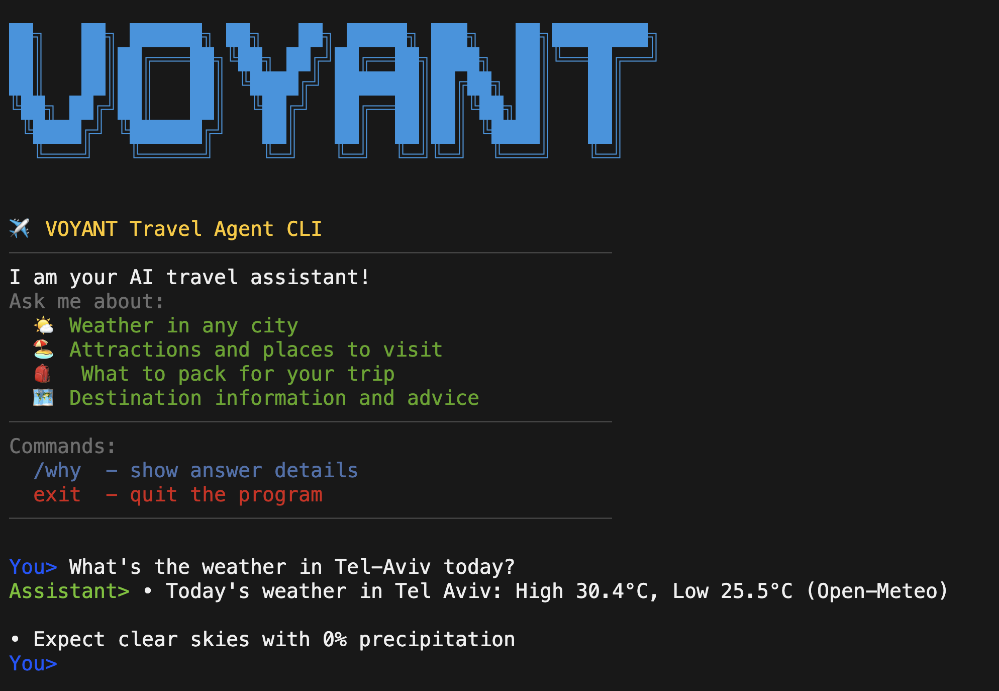

# Voyant Travel Assistant

Enterprise-grade AI travel assistant with advanced RAG and multi-modal research.



Production-ready travel assistant featuring Transformers.js NLP, Amadeus flight search, Vectara RAG for policy documents, intelligent web crawling with Playwright, and comprehensive anti-hallucination safeguards.

## Quick Start
```bash
npm install

# CLI
npm run cli

# HTTP server
npm run dev
```

## Minimal Config
- **LLM**: Set `OPENROUTER_API_KEY` or `LLM_PROVIDER_BASEURL` + `LLM_API_KEY` (+ optional `LLM_MODEL`)
- **Flight Search**: `AMADEUS_CLIENT_ID` + `AMADEUS_CLIENT_SECRET` for live flight data
- **RAG/Policy**: `VECTARA_API_KEY` + `VECTARA_CUSTOMER_ID` + corpus IDs for policy document search
- **Web Search**: `BRAVE_SEARCH_API_KEY` or `TAVILY_API_KEY` for fallback research
- **Optional APIs**: `OPENTRIPMAP_API_KEY` for enhanced attraction data
- **Features**: `DEEP_RESEARCH_ENABLED=true`, `POLICY_RAG=on`, `SEARCH_PROVIDER=brave|tavily`
- **Monitoring**: `METRICS=json|prom` for observability

## Highlights
- **Advanced NLP Pipeline**: Transformers.js with multilingual NER, intent classification, and 20-40% latency reduction via smart routing cascade
- **Live Flight Search**: Amadeus API integration with complete itineraries, pricing, connection details, and natural language date parsing
- **Enterprise RAG**: Vectara integration for policy documents with paragraph-level citations and quality assessment
- **Multi-Modal Research**: Crawlee/Playwright-powered web crawling for complex queries with AI summarization
- **Production Architecture**: Circuit breakers, rate limiting, comprehensive test suite (685+ tests), and Prometheus metrics
- **Anti-Hallucination**: Self-verification system with citation validation and fact-checking mechanisms
- **9 Intent Types**: weather, packing, destinations, attractions, flights, policy, system, web_search, unknown with context-aware routing

## Roadmap (Priority Order)
1. **Policy Browser Mode v1**: Headless Playwright navigation to official policy pages with screenshot+DOM evidence, verbatim citations, and content hashing for chain of custody
2. **IRROPS & Partial-Leg Changes**: Agentic flow for disruption handling with MCT/fare rule validation, A/B/C options with cited policy rules
3. **Hotels & Stays (Amadeus)**: City + dates + guests search with policy compliance filtering, loyalty integration, and unified itinerary view
4. **Profile & Policy Guardrail Engine**: YAML-based rules engine for corporate travel policy with IN-POLICY/OUT-OF-POLICY badges and exception workflows
5. **Unified Itinerary & Smart Notifications**: Merged flights+hotels+POIs with ICS export and proactive nudges (check-in, gate changes, cancellation windows)
6. **Trip Risk & Resilience Score**: Predictive disruption scoring with Plan B recommendations based on MCT buffers, weather patterns, and carrier reliability
7. **Enterprise Observability & Packaging**: P95/P99 metrics, OpenAPI documentation, Docker/Lambda packaging, and cost guardrails with budget controls

## Agent Decision Flow

See docs/AGENT_DECISION_FLOW.md for the current routing/consent/RAG diagram.

---

Demo page: [View Live Demo](https://chernistry.github.io/voyant/) for a guided tour and sample transcripts.
