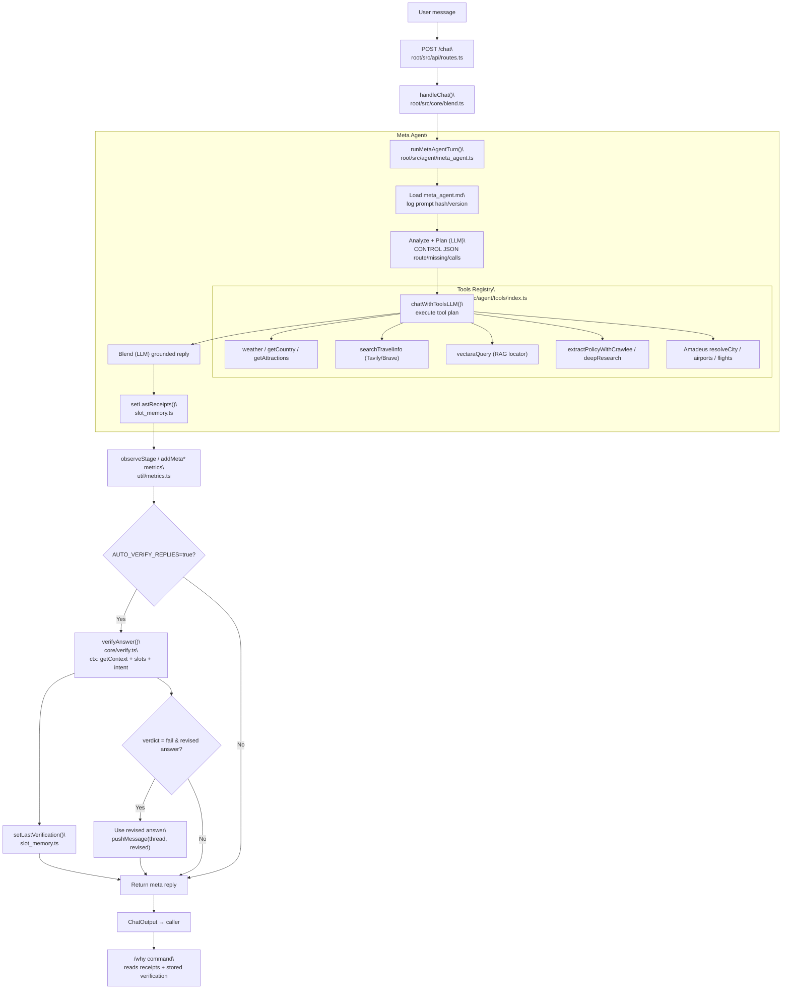
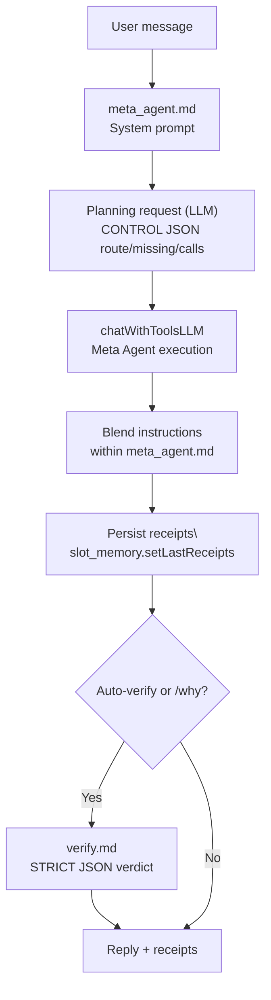

# Voyant Travel Assistant

Single meta‑agent pipeline that plans tool calls, executes, writes receipts,
and verifies before reply. Built for fast, trustworthy answers with clear
provenance and resilient I/O.

Quick start: `cd root && npm install && npm run build && npm run start`.
For CLI: `cd root && npm run cli`. Minimal env: `LLM_PROVIDER_BASEURL` +
`LLM_API_KEY` (or `OPENROUTER_API_KEY`), plus optional Amadeus/Vectara/Search
keys when those tools are used.

Architecture focuses on AI‑first planning (OpenAI‑style tools), strict JSON
parsing via Zod, non‑blocking async I/O with explicit timeouts/signals, and a
verification pipeline that stores receipts and artifacts for `/why`.

**Agent Decision Flow**

**Prompts Flow**

Docs: see `docs/index.html` for quick links to prompts/observability.
