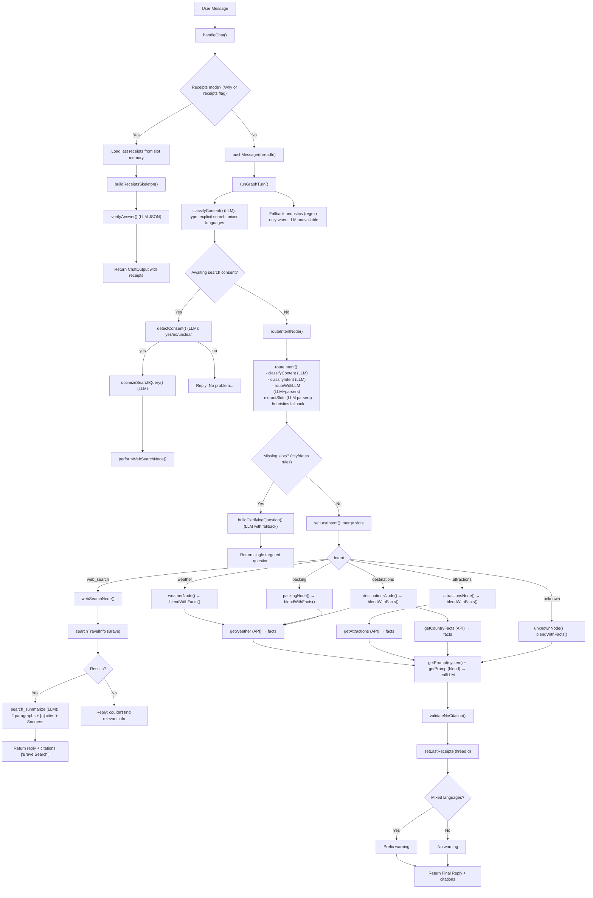

# Voyant Travel Assistant

>Builds trust, then answers fast.


>This minimalist, fact-grounded travel assistant employs an LLM-driven approach for NLP tasks (intent classification, slot filling, context-aware generation), pulling verified data from trusted APIs (Open-Meteo/REST Countries/OpenTripMap) with multi-layered hallucination prevention via mandatory citations and secondary verification.

## Why is it cool?

- Plugs directly into your stack
- Self-evaluates and prevents hallucinations
- Falls back to Brave web search when APIs fail
- End-to-end tests with actual agent interactions using LLM-based eval
## Notes on Prompt Engineering

- **Format Priming**: Enforced JSON/bullet-point schemas ensure structured, parseable outputs while preventing hallucinations
- **Few-Shot Prompting**: Curated examples in router.md and cot.md train accurate intent classification and slot extraction
- **Chain-of-Thought**: Structured reasoning in cot.md and verify.md decomposes analysis into verifiable steps
- **Guardrails**: blend.md requires fact-grounding + verify.md provides secondary validation of claims

## Other perks

- Anti-hallucination receipts with self-check and sources
- Resilient data blend: APIs → search fallback when providers fail
- Smart routing + memory for natural multi-turn conversations
- Clean interfaces: interactive CLI and REST API
- Strong engineering: TS+Zod validation, tests, metrics, structured logs

## Quick Start
```bash
# Install dependencies
npm install

# Start CLI
npm run cli

# Or start HTTP server
npm run dev

# Run tests
npm test

# Generate test transcripts (JSON + Markdown)
npm run test:transcripts

# Alternative: RECORD_TRANSCRIPTS=true npm test
```

## What it demonstrates

- Conversational quality with context carry-over
- Prompt design with guided reasoning and concise outputs
- Decision policy: when to call APIs vs rely on model knowledge (never by design)
- Failure handling: retries, graceful degradation, verifiable answers

## External APIs

The agent connects to several external APIs for real-time travel data, with resilient fallback mechanisms:

- **Open-Meteo API** - Weather forecasts and geocoding (city coordinates resolution)
- **REST Countries API** - Country information (currency, languages, region, capital)
- **OpenTripMap API** - Tourist attractions and points of interest search
- **Brave Search API** - Fallback search engine for weather, country data, and attractions when primary APIs fail. Features LLM-powered summarization of search results into coherent 2-paragraph responses with numbered citations.
- **OpenRouter API** - Free-tier LLM service for natural language processing

## Configuration

### Environment Variables

```bash
# Configure LLM provider (optional)
export LLM_PROVIDER_BASEURL="https://api.openai.com/v1"
export LLM_API_KEY="your-api-key"
export LLM_MODEL="gpt-4"

# Or use free tier
export OPENROUTER_API_KEY="your-openrouter-key"

# Search summarization (default: on)
export SEARCH_SUMMARY=on  # or 'off' to disable
```

## Testing & Transcripts

Generate conversation transcripts during E2E tests for assignment deliverables:

```bash
# Run tests with transcript recording
npm run test:transcripts

# Or manually enable transcripts
RECORD_TRANSCRIPTS=true npm test

# Run specific tests
RECORD_TRANSCRIPTS=true npm test -- tests/e2e_comprehensive_flow.test.ts
```

**Output**: JSON + Markdown transcripts in `deliverables/transcripts/` directory

## Agent Decision Flow



## Usage

### CLI Interface
```bash
# Interactive conversation
npm run cli

You> What's the weather in Tel-Aviv today?
Assistant> • Today's weather in Tel Aviv: High 30.4°C, Low 25.5°C (Open-Meteo)

You> /why
Assistant> --- RECEIPTS ---
Sources: Open-Meteo
Decisions: Used weather API because user asked about weather or it informs packing.
Self-Check: pass (All data points are covered by the provided fact.)
Budget: 0ms API, ~400 tokens
```

### REST API (example)
```bash
# Get weather with receipts
curl -X POST http://localhost:3000/chat \
  -H "Content-Type: application/json" \
  -d '{"message":"What to pack for Tokyo in March?", "receipts": true}'
```
