# Voyant Travel Assistant

>Builds trust, then answers fast.


>This minimalist, fact-grounded travel assistant employs an LLM-driven approach for NLP tasks (intent classification, slot filling, context-aware generation), pulling verified data from trusted APIs (Open-Meteo/REST Countries/OpenTripMap) with multi-layered hallucination prevention via mandatory citations and secondary verification.

## Why is it cool?

- Self-evaluates and prevents hallucinations
- Falls back to Brave web search when APIs fail
- End-to-end tests with actual agent interactions using LLM-based eval

## Notes on Prompt Engineering

- **Format Priming**: Enforced JSON/bullet-point schemas ensure structured, parseable outputs while preventing hallucinations
- **Few-Shot Prompting**: Curated examples in router.md and cot.md train accurate intent classification and slot extraction
- **Chain-of-Thought**: Structured reasoning in cot.md and verify.md decomposes analysis into verifiable steps
- **Guardrails**: blend.md requires fact-grounding + verify.md provides secondary validation of claims

## Other perks

- Anti-hallucination receipts with self-check and sources
- Resilient data blend: APIs → search fallback when providers fail
- Smart routing + memory for natural multi-turn conversations
- Clean interfaces: interactive CLI and REST API
- Strong engineering: TS+Zod validation, tests, metrics, structured logs

## Quick Start
```bash
# Install dependencies
npm install

# Start CLI
npm run cli

# Or start HTTP server
npm run dev

# Run tests
npm test

# Generate test transcripts (JSON + Markdown)
npm run test:transcripts

# Alternative: RECORD_TRANSCRIPTS=true npm test
```

## What it demonstrates

- Conversational quality with context carry-over
- Prompt design with guided reasoning and concise outputs
- Decision policy: when to call APIs vs rely on model knowledge (never by design)
- Failure handling: retries, graceful degradation, verifiable answers

## External APIs

The agent connects to several external APIs for real-time travel data, with resilient fallback mechanisms:

- **Open-Meteo API** - Weather forecasts and geocoding (city coordinates resolution)
- **REST Countries API** - Country information (currency, languages, region, capital)
- **OpenTripMap API** - Tourist attractions and points of interest search
- **Brave Search API** - Fallback search engine for weather, country data, and attractions when primary APIs fail. Features LLM-powered summarization of search results into coherent 2-paragraph responses with numbered citations.
- **OpenRouter API** - Free-tier LLM service for natural language processing

## Configuration

### Environment Variables

```bash
# Configure LLM provider (optional)
export LLM_PROVIDER_BASEURL="https://api.openai.com/v1"
export LLM_API_KEY="your-api-key"
export LLM_MODEL="gpt-4"

# Or use free tier
export OPENROUTER_API_KEY="your-openrouter-key"

# Search summarization (default: on)
export SEARCH_SUMMARY=on  # or 'off' to disable
```

## Testing & Transcripts

Generate conversation transcripts during E2E tests for assignment deliverables:

```bash
# Run tests with transcript recording
npm run test:transcripts

# Or manually enable transcripts
RECORD_TRANSCRIPTS=true npm test

# Run specific tests
RECORD_TRANSCRIPTS=true npm test -- tests/e2e_comprehensive_flow.test.ts
```

**Output**: JSON + Markdown transcripts in `deliverables/transcripts/` directory

## Agent Decision Flow

🔗 [View Interactive Flow Diagram](https://mermaidchart.com/play#pako:eNq1WFtT2zgU_itnPLNDmAIhFy5Jd9qBQIEWaJuEAIFOR7GVWIsteSWZkAIzfdr33f2H_SV7JDm2Q9lZXpYXkHzul-8cce_5IqBe27vm40hM_ZBIDf29aw74s3N17Z0pKuGEKkUm9Nr7Aqurb2AX70PCg4h2QqIry3jvGHbt5879tdelPmWJVhCj-LdQqU7DGQgJMrtHnkfH0zE8D5dUPUC3hoKPBQkgIkrntDCWIgYVCQ0xjYWc5fq6NauwW0e-UcqiYK62d0MjqgUv2datO9oG0t5SycazHa6mVFaWoXJ8fALvex9PS9QNR928Mr7oVPLcnFXBoxmekqgwxDlxKh5gDxmSVIVZyCo6lJQER0Ehes9K3kc6mfIDSZKwj-IrsWNYgUUOx_PLL_BJ0lUpUs34BPyQ-jeqDb7ginINE6KpI9y3wt-hcB9jqNDLjuAaaTI3l9ugZwlqoXdJxHymQVEi_XAFYnZHTeD5JEUzVG7uOyvxAHO6MyXMqncsc-1v81QeFKk8MKkMqKa-7jiywoAZVVUuqin3IxSUKzqwyXyYGfZDwy4SzWL2jfasus8plbNSPg9d7g9N7hMqx0LG53TkaE-x6Mqk9YyUIK1K45jIXGyXqjTCGrO2wY8__nKZhVeAwSGaofFwtbQryS0Fx7H05anJHPN-2LCVgqxtOBWQSDGKaLy2tlYQ5zVyZHKPqaRHNjUla_Nsd7NMY5fZylfuy5F15P0if2W5_etIvlmFJyk3PmQ3jtA56WjpnZbE1z0jGyro66waYBVBQiR2vMqoTGNYTRKFjUkUjYh_AyFNJVOa-UWVvLeGfcAqOWGo0RSJkfy2JFqBTCNa6vwPRbkc1-Yd3ImI6U2UgAlXJv7zBjW5mZtQ5PbYlcFxvWhUoz6ioImcYAEG8HsmKOf5kGfixBQE1ccIN_NYvkaQQUZn_2tIE2N73_akDdbTTGWhVVOm_dDdnliTTjEY7mPu8alVPKVEh1Q-wGfUnh1cDVgfsW54cM50-A7zo0pl7LgD4wx3lYmQadusuHm5nATDiIF6gJ5pIHd4OTfRtnycEX2UULp4uZQpHX11YPIAZzYYzzewo1YzpWmMBl8ak93pWcKU33Ax5Q8wQLrs8F9G5fnM4ArEeIx9AIwrFlD8ZRKZdWHf5re_gwmWGHuSSsJ1dZQGWG-m2uSswMT-TlHl_Z2OqzcgGZRm3n-dA_krSNC20gcr7TUQdZODvRaAccpAOPc802OKur9u4B8xgPGUFhPNDbRdNHocsUn4bwZ3d0sDeff_MzjTYwzu_mRwng2bIpcxi4UIW1RyEqFQEWXp-Gw9OzcQgv6cu4aCyke07Mf3P08QA8QCeIBF8-XsDuXnNvUySZmF688eG05PR6Rcy5kzsNLd7_XBXTFEupepm0s0SwZuFyKO0c29UjcjehJNIjHBOC9qeE5c34nrm0CcsxuW0IARKDXmczxugo0Ji6o0TvQMy8dAqQleX7LkhCTPOPNEUJ6t8zzNOEd0hoZn1qqLmq0k861vRERHfCyg4mKTm3Ph0PyibldIO5mLyryoF5V50cjFfc0n-nzBqP34_nfDTDIyMeuVAsTmEK74FzPTMTuvoCdS6eNfEY6xQrnb-S4Wdr4X7wKZdaaeLzaKXcAXaRTwJQ1jhuUrcS29RbBAPBmLxdidOZzKkAbsfo195b4PrGWDGoZlf3FxM0s1pzRQpR4rQjaoFSE7W7gydg5MmM84GoUjLqj2LKJW9xEVwCeKlkI_cM7ltMhb2neOlmIgoG1awSwciInoAq5k80uDCqy0VGbyegWiL9zvx-I3Vj1goxGyqbC6byqzOkBkgUiYmTUwOdpBjDE6CNhFkpa1LQ78TOxHAwxTpqhZOBYgP06EoiZFiCzEPgvcx3NXj5eu5T_hOyTRFTd5qr5ACDXA5HrRxw7B8st1nrtqusxOzfKpX1s41cunQflwaQ9D0zu3JGJmFTkVnawYS3Nv6AQOTUJtX2LdRREu3zQokjgs9c-wUWw-80fTM2-VoXNiuGnCnRioB8FxN7Ltg4sSN3YAG-PrwW59BWPRDcPN7GrTydqyS-LCY6Nk41bJxm3Uis-eMbuDKZF8Qf5WIb-FZLhy_0SynQVvvehnl2HX1ZVyW6MLhM9KjrfmzAvDyIGgWnhrzS9Ry-F8MYb5S82-Fach5XaVTjm5RaQlWDZVfG2bCTnG7YL7Zup5K95EssBra5nSFQ-30JiYo3dv1F17WLwx0rXBbHxjgth4ja_2R2RLCB8KEc85Ufck9NoI2QpPboHdYwYL4_xWYiqptOPEa282W1aI17737rz2ar3eWGtubNW3axu1za2NZqO54s3wvtFqrjXqza3aZmu7XttotZqPK943q7m2tlnfarY2ttbrjcZGbb21seLh-NFCnrj_L9h_Mzz-A9xQUpQ@index.html)

```mermaid
flowchart TD
    A["User Message"] --> B["handleChat()"]
    B --> C{"Receipts mode? (/why or receipts)"}
    C -->|Yes| R1["Load last receipts from slot memory"]
    R1 --> R2["buildReceiptsSkeleton()"]
    R2 --> R3["verifyAnswer() (LLM JSON)"]
    R3 --> R4["Return receipts-only reply"]
    C -->|No| D["pushMessage(threadId)"]
    D --> E["runGraphTurn(message, threadId)"]

    %% Pre-routing checks: consent gate
    E --> F["classifyContent() (LLM): type, explicit search, mixed languages"]
    F --> G{"Awaiting search consent?"}
    G -->|Yes| G1["detectConsent() (LLM): yes/no/unclear"]
    G1 -->|yes| H1["optimizeSearchQuery()"]
    H1 --> H2["performWebSearchNode()"]
    H2 --> H2a["summarizeSearchResults (LLM) → reply + citations ['Brave Search']"]
    G1 -->|no| H3["Reply: No problem..."]
    G -->|No| I["routeIntentNode()"]

    %% Routing and slots
    I --> J["routeIntent():<br>- classifyContent + classifyIntent (LLM)<br>- extractSlots (city/date parsers)<br>- LLM router + fallback heuristics"]
    J --> K{"Missing slots? (city/dates rules)"}
    K -->|Yes| L1["buildClarifyingQuestion() (LLM → fallback)"]
    L1 --> L2["Return single targeted question"]
    K -->|No| M["setLastIntent(); merge slots; updateThreadSlots()"]

    %% Intent switch
    M --> N{"Intent"}
    N -->|weather| Q["weatherNode() → blendWithFacts()"]
    N -->|destinations| R["destinationsNode() → blendWithFacts()"]
    N -->|packing| S["packingNode() → blendWithFacts()"]
    N -->|attractions| T["attractionsNode() → blendWithFacts()"]
    N -->|web_search| U["webSearchNode()"]
    N -->|system| SYS["systemNode()"]
    N -->|unknown| V["unknownNode() → blendWithFacts()"]

    %% Consent offers inside intents
    T --> TA{"restaurant/budget query?"}
    TA -->|Yes| TAC["set awaiting_search_consent + pending_search_query; ask consent to web search"]
    TA -->|No| T0["continue"]
    R --> RB{"flight/budget query?"}
    RB -->|Yes| RBC["set awaiting_search_consent + pending_search_query; ask consent to web search"]
    RB -->|No| R0["continue"]

    %% Facts blend and external tools
    Q --> W1["getWeather (Open‑Meteo → fallback Brave) → facts"]
    S --> W1
    R0 --> W1
    R0 --> W3["getCountryFacts (REST Countries → fallback Brave) → facts"]
    R0 --> W4["recommendDestinations (catalog + REST Countries) → facts"]
    T0 --> T1["Wikipedia attractions → facts"]
    T1 -->|fail/empty| T2["OpenTripMap → fallback Brave → facts"]

    %% Web search path
    U --> X1["searchTravelInfo (Brave)"]
    X1 --> X2{"Results?"}
    X2 -->|Yes| X3["search_summarize (LLM): 1–3 paragraphs with [n] cites + Sources list"]
    X3 --> X4["Return reply + citations ['Brave Search']"]
    X2 -->|No| X5["Reply: couldn't find relevant info"]

    %% Unknown intent handling
    V --> V1{"Explicit search or needs web search?"}
    V1 -->|Yes| U
    V1 -->|No| V2{"Unrelated/System/Edge cases?"}
    V2 -->|Unrelated| V3["Reply: I'm a travel assistant for travel queries"]
    V2 -->|System| SYS
    V2 -->|Emoji/Gibberish/Empty/Very long| V4["Ask for a clearer travel question"]
    V2 -->|Otherwise| L1

    %% Compose final answer
    W1 --> Y["getPrompt(system/cot/blend) → callLLM"]
    W3 --> Y
    W4 --> Y
    T1 --> Y
    T2 --> Y
    V --> Y
    Y --> Z1["validateNoCitation()"]
    Z1 --> Z2{"facts collected?"}
    Z2 -->|Yes| Z3["setLastReceipts(threadId)"]
    Z3 --> Z6["Append one source mention if missing"]
    Z2 -->|No| Z6
    Z6 --> Z7{"Mixed languages?"}
    Z7 -->|Yes| Z8["Prefix warning"]
    Z7 -->|No| Z9["No warning"]
    Z8 --> Z10["Return final reply (+ citations if any)"]
    Z9 --> Z10

    %% Fallbacks
    E --> Fallbacks["Heuristic routing only when LLM unavailable/low confidence"]
```



## Usage

### CLI Interface
```bash
# Interactive conversation
npm run cli

You> What's the weather in Tel-Aviv today?
Assistant> • Today's weather in Tel Aviv: High 30.4°C, Low 25.5°C (Open-Meteo)

You> /why
Assistant> --- RECEIPTS ---
Sources: Open-Meteo
Decisions: Used weather API because user asked about weather or it informs packing.
Self-Check: pass (All data points are covered by the provided fact.)
Budget: 0ms API, ~400 tokens
```

### REST API (example)
```bash
# Get weather with receipts
curl -X POST http://localhost:3000/chat \
  -H "Content-Type: application/json" \
  -d '{"message":"What to pack for Tokyo in March?", "receipts": true}'
```
