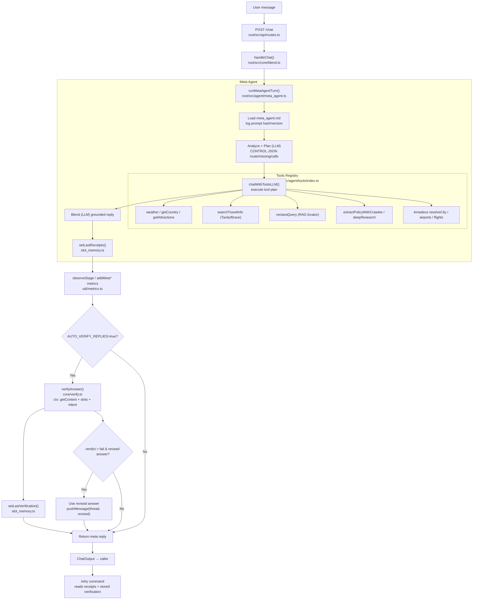

Implementation Map (Big‑LLM First)
- API entry: `root/src/api/routes.ts` (handles `/chat`, `/metrics`, `/why`).
- Orchestrator: `root/src/core/blend.ts` (stores user turns, auto-verify, metrics).
- Meta agent runner: `root/src/agent/meta_agent.ts` (loads `meta_agent.md`, calls `callChatWithTools`).
- Tools + planning: `root/src/agent/tools/index.ts` (CONTROL JSON planner, vectara/search/deepResearch/Amadeus).
- LLM adapters: `root/src/core/llm.ts` (callLLM, chatWithToolsLLM; honours env temps/top_p/top_k/max tokens).
- Session & context: `root/src/core/session_store.ts`, `stores/{inmemory,cloudflare}.ts` (no message cap when `SESSION_MAX_MESSAGES=0`).
- Receipts & verification: `root/src/core/slot_memory.ts`, `core/verify.ts` (strict JSON, shared by auto-verify & `/why`).
- Metrics & dashboard: `root/src/util/metrics.ts`, `util/metrics-server.ts`, `root/public/metrics-dashboard.html`.
- Resilience & rate limits: `root/src/core/circuit-breaker.ts`, `util/limiter.ts`, Bottleneck/cockatiel wiring in tools.
