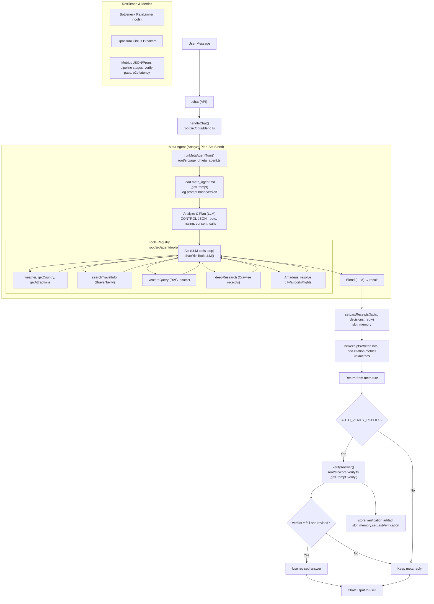

Implementation Map (Big‑LLM First)
- Entry/API: `root/src/api/routes.ts`, `root/src/schemas/chat.ts`
- Orchestrator: `root/src/core/blend.ts` (handleChat)
- Meta‑agent runner: `root/src/agent/meta_agent.ts`
- Tools registry + planning prompt (CONTROL JSON): `root/src/agent/tools/index.ts`
- LLM client + tools: `root/src/core/llm.ts` (chatWithToolsLLM, callLLM)
- Receipts & verification: `root/src/core/receipts.ts`, `root/src/core/verify.ts`, `root/src/core/slot_memory.ts`
- External adapters: `root/src/tools/*.ts`, `root/src/core/deep_research.ts`, `root/src/tools/crawlee_research.ts`, `root/src/tools/vectara.ts`, `root/src/tools/amadeus_*`
- Resilience & metrics: `root/src/util/metrics.ts`, `root/src/util/circuit.ts`, `root/src/core/circuit-breaker.ts`, `root/src/util/limiter.ts`, `root/src/util/metrics-server.ts`, `root/src/api/server.ts`
