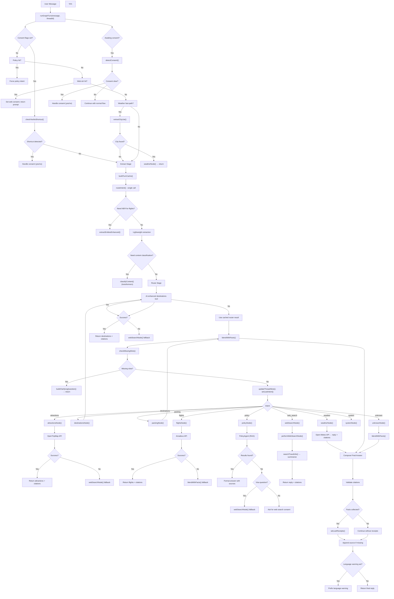

```mermaid
flowchart TD
    A["User Message"] --> B["runGraphTurn(message, threadId)"]

    %% G-E-R-A Pattern: Guard → Extract → Route → Act
    %% GUARD STAGE: Fast micro-rules first
    B --> G1{"Consent flags set?"}
    G1 -->|Yes| G2["checkYesNoShortcut()"]
    G2 --> G3{"Shortcut detected?"}
    G3 -->|Yes| G4["Handle consent (yes/no)"]
    G3 -->|No| E
    G1 -->|No| G5["Policy hit?"]
    G5 -->|Yes| G6["Force policy intent"]
    G5 -->|No| G7["Web-ish hit?"]
    G7 -->|Yes| G8["Set web consent; return prompt"]
    G7 -->|No| G9["Weather fast-path?"]
    G9 -->|Yes| G10["extractCityLite()"]
    G10 --> G11{"City found?"}
    G11 -->|Yes| G12["weatherNode() → return"]
    G11 -->|No| E
    G9 -->|No| E

    %% EXTRACT STAGE: Single-pass cached extraction
    E["Extract Stage"] --> E1["buildTurnCache()"]
    E1 --> E2["routeIntent() - single call"]
    E2 --> E3{"Need NER for flights?"}
    E3 -->|Yes| E4["extractEntitiesEnhanced()"]
    E3 -->|No| E5["Lightweight extraction"]
    E5 --> E6{"Need content classification?"}
    E6 -->|Yes| E7["classifyContent() (transformers)"]
    E6 -->|No| R

    %% ROUTE STAGE: Decision table
    R["Route Stage"] --> R1{"Unrelated content?"}
    R1 -->|Yes| R2["Return travel focus message"]
    R1 -->|No| R3["Use cached router result"]

    %% SLOT PROCESSING
    R3 --> S1["normalizeSlots()"]
    S1 --> S2["checkMissingSlots()"]
    S2 --> S3{"Missing slots?"}
    S3 -->|Yes| S4["buildClarifyingQuestion() → return"]
    S3 -->|No| S5["updateThreadSlots(); setLastIntent()"]

    %% ACT STAGE: Route to domain nodes
    S5 --> N{"Intent"}
    N -->|weather| Q["weatherNode()"]
    N -->|destinations| RD["destinationsNode()"]
    N -->|packing| S["packingNode()"]
    N -->|attractions| T["attractionsNode()"]
    N -->|policy| P["policyNode()"]
    N -->|flights| F["flightsNode()"]
    N -->|web_search| U["webSearchNode()"]
    N -->|system| SYS["systemNode()"]
    N -->|unknown| V["unknownNode()"]

    %% UNIFIED CONSENT HANDLING
    B --> C1{"Awaiting consent?"}
    C1 -->|Yes| C2["detectConsent()"]
    C2 --> C3{"Consent clear?"}
    C3 -->|Yes| C4["Handle consent (yes/no)"]
    C3 -->|No| C5["Continue with normal flow"]

    %% Domain Node Implementations
    Q --> Q1["Open-Meteo API → reply + citations"]
    Q1 --> Z
    
    RD --> R1["AI-enhanced destinations tool"]
    R1 --> R2{"Success?"}
    R2 -->|Yes| R3OUT["Return destinations + citations"]
    R2 -->|No| R4["webSearchNode() fallback"]
    
    S --> S1["blendWithFacts()"]
    S1 --> Z
    
    T --> T1["OpenTripMap API"]
    T1 --> T2{"Success?"}
    T2 -->|Yes| T3["Return attractions + citations"]
    T2 -->|No| T4["webSearchNode() fallback"]
    
    F --> F1["Amadeus API"]
    F1 --> F2{"Success?"}
    F2 -->|Yes| F3["Return flights + citations"]
    F2 -->|No| F4["blendWithFacts() fallback"]
    
    P --> P1["PolicyAgent (RAG)"]
    P1 --> P2{"Results found?"}
    P2 -->|Yes| P3["Format answer with sources"]
    P2 -->|No| P4{"Visa question?"}
    P4 -->|Yes| P5["webSearchNode() fallback"]
    P4 -->|No| P6["Ask for web search consent"]
    
    U --> U1["performWebSearchNode()"]
    U1 --> U2["searchTravelInfo() → summarize"]
    U2 --> U3["Return reply + citations"]
    
    V --> V1["blendWithFacts()"]
    V1 --> Z

    %% Compose final answer
    Z["Compose Final Answer"] --> Z1["Validate citations"]
    Z1 --> Z2{"Facts collected?"}
    Z2 -->|Yes| Z3["setLastReceipts()"]
    Z2 -->|No| Z4["Continue without receipts"]
    Z3 --> Z5["Append source if missing"]
    Z4 --> Z5
    Z5 --> Z6{"Language warning set?"}
    Z6 -->|Yes| Z7["Prefix language warning"]
    Z6 -->|No| Z8["Return final reply"]

%% Key Implementation Details:
%% 
%% 1. G-E-R-A Pattern (Guard → Extract → Route → Act):
%%    - Guard: Fast micro-rules for early exits
%%    - Extract: Single-pass cached extraction with intent-gated extractors
%%    - Route: Decision table using cached router results
%%    - Act: Domain-specific nodes
%%
%% 2. Performance Optimizations:
%%    - Single router call per turn
%%    - Intent-gated extractors (only run when needed)
%%    - Fast-path optimizations (weather, policy, web-ish)
%%    - Cached results for extraction
%%    - Unified consent handling
%%
%% 3. Domain Nodes:
%%    - weather: Open-Meteo API with fallback
%%    - destinations: AI-enhanced catalog with web search fallback
%%    - packing: blendWithFacts approach
%%    - attractions: OpenTripMap with web search fallback
%%    - flights: Amadeus API with blend fallback
%%    - policy: PolicyAgent (RAG) with web search fallback
%%    - web_search: Brave search with summarization
%%    - system: Static responses
%%    - unknown: blendWithFacts approach
%%
%% 4. Consent Handling:
%%    - Unified consent state management
%%    - Micro-rules for obvious yes/no responses
%%    - LLM fallback for ambiguous responses
%%
%% 5. Error Handling:
%%    - Tool-specific fallbacks
%%    - Graceful degradation to web search
%%    - Clear error messages to users
```