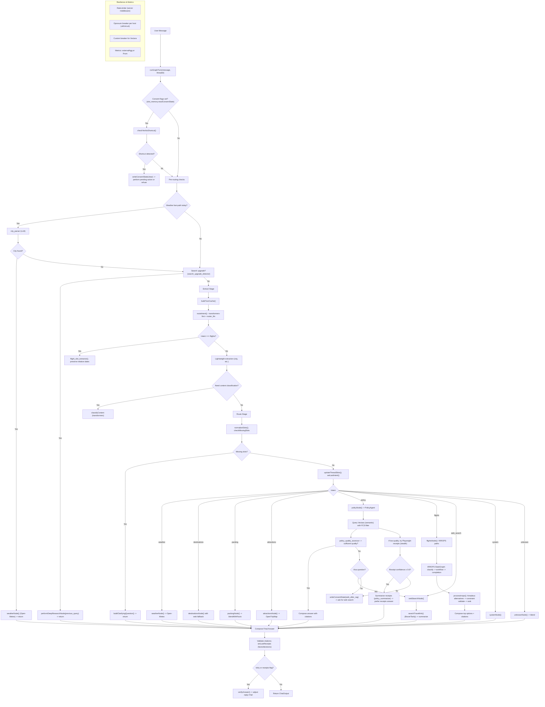

Implementation Map (code anchors)
- Orchestrator G‑E‑R‑A: `src/core/graph.ts`
- Router fast-paths and LLM router: `src/core/router.ts`
- Consent state read/write: `src/core/slot_memory.ts`
- PolicyAgent (RAG + browser receipts + summarizer): `src/core/policy_agent.ts`, `src/tools/policy_browser.ts`, `src/schemas/vectara.ts`
- IRROPS subgraph and engine: `src/agent/graphs/irrops.graph.ts`, `src/core/irrops_engine.ts`
- API `/chat` + receipts + self-check: `src/api/routes.ts`, `src/schemas/chat.ts`, `src/core/verify.ts`, `src/core/receipts.ts`
- Resilience & Metrics: `src/util/limiter.ts`, `src/util/circuit.ts`, `src/core/circuit-breaker.ts`, `src/util/metrics.ts`, `src/api/server.ts`
- Deep search upgrade detector: `src/core/search_upgrade.ts`
- Deep research consent (complexity assessor): `src/core/complexity.ts`
