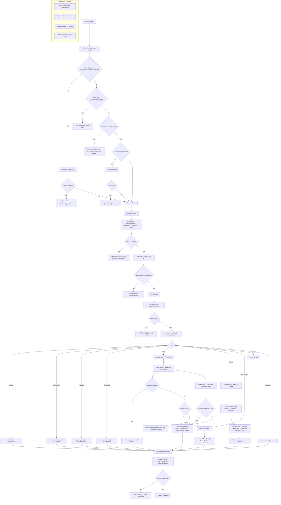

# Navan Travel Assistant - Comprehensive Technical Knowledge Base

*Last Updated: September 16, 2025*

## Table of Contents

### 1. [Project Overview](#1-project-overview)
- [1.1 Business Context](#11-business-context)
- [1.2 Core Mission](#12-core-mission)
- [1.3 Technology Stack](#13-technology-stack)
- [1.4 Development Timeline](#14-development-timeline)

### 2. [Architecture Deep Dive](#2-architecture-deep-dive)
- [2.1 G-E-R-A Orchestration Pattern](#21-g-e-r-a-orchestration-pattern)
- [2.2 Core Architecture Patterns](#22-core-architecture-patterns)
- [2.3 Codebase Structure Analysis](#23-codebase-structure-analysis)
- [2.4 Core Components Deep Dive](#24-core-components-deep-dive)
- [2.5 Data Flow Architecture](#25-data-flow-architecture)
- [2.6 State Management System](#26-state-management-system)

### 3. [AI/ML Capabilities](#3-aiml-capabilities)
- [3.1 NLP Pipeline Architecture](#31-nlp-pipeline-architecture)
- [3.2 Transformers-First Strategy](#32-transformers-first-strategy)
- [3.3 Model Selection & Fallback Chains](#33-model-selection--fallback-chains)
- [3.4 Anti-Hallucination Safeguards](#34-anti-hallucination-safeguards)

### 4. [External Integrations & Data Flow](#4-external-integrations--data-flow)
- [4.1 Travel APIs (Amadeus)](#41-travel-apis-amadeus)
- [4.2 Weather & Location Services](#42-weather--location-services)
- [4.3 Knowledge Bases (Vectara RAG)](#43-knowledge-bases-vectara-rag)
- [4.4 Web Search & Deep Research](#44-web-search--deep-research)
- [4.5 Integration Architecture Patterns](#45-integration-architecture-patterns)
- [4.6 Data Flow Architecture](#46-data-flow-architecture)

### 5. [Resilience & Reliability](#5-resilience--reliability)
- [5.1 Circuit Breaker Pattern](#51-circuit-breaker-pattern)
- [5.2 Rate Limiting](#52-rate-limiting)
- [5.3 Retry Mechanisms](#53-retry-mechanisms)
- [5.4 Error Handling](#54-error-handling)

### 6. [Core Features Implementation](#6-core-features-implementation)
- [6.1 Policy Browser Mode](#61-policy-browser-mode)
- [6.2 IRROPS & Disruption Handling](#62-irrops--disruption-handling)
- [6.3 Hotel Search Integration](#63-hotel-search-integration)
- [6.4 Unified Itineraries](#64-unified-itineraries)
- [6.5 Risk Assessment Engine](#65-risk-assessment-engine)

### 7. [Development & Testing](#7-development--testing)
- [7.1 Development Workflow](#71-development-workflow)
- [7.2 Testing Strategy](#72-testing-strategy)
- [7.3 Quality Assurance](#73-quality-assurance)
- [7.4 Code Organization](#74-code-organization)

### 8. [Observability & Monitoring](#8-observability--monitoring)
- [8.1 Metrics Collection](#81-metrics-collection)
- [8.2 Logging Strategy](#82-logging-strategy)
- [8.3 Performance Monitoring](#83-performance-monitoring)
- [8.4 Alerting & Health Checks](#84-alerting--health-checks)

### 9. [Interview Preparation Guide](#9-interview-preparation-guide)
- [9.1 Common Technical Questions](#91-common-technical-questions)
- [9.2 Architecture Decisions](#92-architecture-decisions)
- [9.3 Technical Challenges](#93-technical-challenges)
- [9.4 Performance & Scalability](#94-performance--scalability)

### 10. [Deployment & Production](#10-deployment--production)
- [10.1 Containerization](#101-containerization)
- [10.2 Serverless Deployment](#102-serverless-deployment)
- [10.3 Environment Configuration](#103-environment-configuration)
- [10.4 Security Considerations](#104-security-considerations)

---

## 1. Project Overview

### 1.1 Business Context

The Navan Travel Assistant is a sophisticated AI-powered travel planning and management system designed to serve enterprise customers (business travelers) and individual users. Built as part of a hiring challenge for a Backend Engineer position at Navan, this project demonstrates advanced AI/ML integration, production-ready architecture, and enterprise-grade reliability features.

#### Job Description Requirements
The project was built to fulfill specific requirements from Navan's Backend Engineer position:
- **5+ years backend development experience** with proficiency in backend languages (Java, Node.js, etc.)
- **AI/ML integration expertise** including LLMs, RAG, and conversational assistants
- **Production-grade APIs** and distributed services development
- **Database experience** with both SQL and NoSQL systems
- **Cloud platform familiarity** (AWS, GCP, Azure)
- **Vector databases and embeddings** knowledge

#### Project Assignment Context
The original assignment focused on demonstrating conversational AI capabilities:
- Build a travel assistant with natural conversation flow
- Handle at least 3 types of travel queries (destinations, packing, attractions)
- Maintain conversation context and handle follow-up questions
- Integrate external APIs for data augmentation
- Demonstrate effective prompt engineering and error handling
- Focus on conversation quality over complex backend systems

**Key Business Objectives:**
- Provide natural, human-like conversation experience for travel planning
- Eliminate AI hallucinations through rigorous fact-checking and citations
- Handle complex travel scenarios including disruptions and policy compliance
- Scale to enterprise usage with comprehensive monitoring and reliability

### 1.2 Core Mission

**"Build a travel assistant that behaves like a real human agent"** - This guiding principle drives every architectural decision and feature implementation. The system must:

- Open multiple "tabs" simultaneously (parallel processing of weather, policies, alternatives)
- Provide verifiable citations for all information
- Handle follow-up questions and maintain conversation context
- Recover gracefully from API failures and disruptions
- Act as a concierge, not just a chatbot

### 1.3 Technology Stack

#### Core Runtime
- **Language**: TypeScript/Node.js (ES2022 modules)
- **Framework**: Express.js for HTTP API
- **Graph Processing**: LangGraph.js for complex workflows
- **State Management**: Custom slot memory with thread persistence

#### AI/ML Stack
- **Primary LLM**: OpenRouter API (Mistral, DeepSeek, Gemma models)
- **NLP Pipeline**: Transformers.js with local model caching
- **Knowledge Base**: Vectara RAG for policy documents
- **Embeddings**: Automatic semantic search with FCS scoring

#### External Integrations
- **Travel APIs**: Amadeus (flights, hotels)
- **Weather**: Open-Meteo API
- **Attractions**: OpenTripMap API
- **Countries**: REST Countries API
- **Web Search**: Brave Search API + Tavily
- **Deep Research**: Crawlee (Cheerio/Playwright)

### 1.6 Architecture Decision Records (ADRs)

The project maintains comprehensive Architecture Decision Records that document key design choices, alternatives considered, and their consequences. These ADRs demonstrate systematic thinking about complex technical decisions.

#### ADR-001: Orchestration Pattern — G-E-R-A with LangGraph Subgraphs
**Context:** Need explicit control over conversation flow while maintaining demo simplicity
**Decision:** Custom G-E-R-A pattern (Guard → Extract → Route → Act) for main path + LangGraph subgraphs for specialized flows
**Rationale:**
- Clear separation of concerns (guards, extraction, routing, actions)
- Easier debugging and testing than generic loops
- Subgraphs composable and production-friendly
**Trade-offs:** More code than generic loops, requires understanding custom pattern
**Evidence:** `src/core/graph.ts`, `src/agent/graphs/irrops.graph.ts`

### 2.2 Core Architecture Patterns

#### G-E-R-A Orchestration Pattern
The system implements a custom **G-E-R-A (Guard → Extract → Route → Act)** orchestration pattern that provides explicit control over conversation flow:



**Implementation Code Structure:**
- **Main Orchestrator**: `src/core/graph.ts` - Core G-E-R-A implementation
- **Router Logic**: `src/core/router.ts` - Intent classification and routing decisions
- **Slot Memory**: `src/core/slot_memory.ts` - Thread-based conversation state
- **Policy Agent**: `src/core/policy_agent.ts` - RAG-first policy information system
- **IRROPS Engine**: `src/core/irrops_engine.ts` - Disruption handling workflow

**Key Technical Advantages:**
1. **Single-Pass Extraction**: Reduces LLM calls by caching entity extraction results
2. **Fast-Path Guards**: Micro-rules prevent unnecessary LLM processing for simple queries
3. **Thread-Based Memory**: Isolated conversation state with automatic cleanup
4. **Consent Management**: Explicit user approval for web searches and data collection
5. **Resilience Patterns**: Circuit breakers and rate limiting for external API calls

### 2.3 Codebase Structure Analysis

#### Directory Structure Overview
```
root/
├── src/                          # Main source code
│   ├── api/                      # HTTP API endpoints and routing
│   │   ├── routes.ts            # Chat API with receipts system
│   │   └── server.ts            # Express server with middleware
│   ├── core/                     # Core business logic (44 files)
│   │   ├── graph.ts             # Main G-E-R-A orchestrator
│   │   ├── router.ts            # Intent classification and routing
│   │   ├── blend.ts             # Chat handling and fact blending
│   │   ├── llm.ts               # LLM provider management
│   │   ├── slot_memory.ts       # Thread-based conversation state
│   │   ├── policy_agent.ts      # RAG-first policy system
│   │   ├── irrops_engine.ts     # Disruption handling
│   │   └── [39 other core modules]
│   ├── tools/                    # External integrations (20 files)
│   │   ├── amadeus_*.ts         # Flight, hotel, location APIs
│   │   ├── brave_search.ts      # Web search integration
│   │   ├── vectara.ts           # RAG knowledge base
│   │   ├── policy_browser.ts    # Browser automation for policies
│   │   └── [16 other integration tools]
│   ├── schemas/                  # TypeScript type definitions
│   │   ├── chat.ts              # Chat API request/response types
│   │   ├── router.ts            # Intent routing schemas
│   │   └── [6 other schema files]
│   ├── prompts/                  # LLM prompt templates (48 files)
│   │   ├── router_llm.md        # Intent classification prompts
│   │   ├── policy_*.md          # Policy-related prompts
│   │   └── [46 other prompt files]
│   ├── config/                   # Configuration management
│   ├── types/                    # TypeScript type utilities
│   └── util/                     # Utility functions
├── tests/                        # Comprehensive test suite
│   ├── unit/                     # 40 unit test files
│   ├── integration/              # 10 integration test files
│   ├── e2e/                      # 18 end-to-end test files
│   └── custom/                   # 23 custom scenario tests
├── docs/                         # Documentation and guides
└── dist/                         # Compiled output
```

#### Key Module Responsibilities

**API Layer (`src/api/`)**
```typescript
// src/api/server.ts - Main Express server
const app = express();
app.use(express.json({ limit: '512kb' }));
app.use('/', router(log));  // Mount API routes
app.get('/healthz', (_req, res) => res.status(200).json({ ok: true }));
app.listen(port, () => log.info({ port }, 'HTTP server started'));

// src/api/routes.ts - Chat API with receipts
r.post('/chat', async (req, res) => {
  const out = await handleChat(parsed.data, { log });
  // Self-verification with receipts system
  if (wantReceipts) {
    const audit = await verifyAnswer({ reply: lastReply, facts, log });
    // Return verified answer with receipts
  }
});
```

**Core Orchestration (`src/core/graph.ts`)**
```typescript
// Main G-E-R-A pattern implementation
export async function runGraphTurn(message: string, threadId: string): Promise<NodeOut> {
  // GUARD STAGE: Fast micro-rules
  const C = await buildTurnCache(message, ctx.log);
  if (checkYesNoShortcut()) return handleShortcut();

  // EXTRACT STAGE: Single-pass cached extraction
  const intent = await routeIntent({ message, threadId });

  // ROUTE STAGE: Decision table
  const slots = await extractSlots(message, ctxSlots);

  // ACT STAGE: Domain-specific nodes
  return await executeDomainNode(intent, slots);
}
```

**Router Logic (`src/core/router.ts`)**
```typescript
// Transformers-first routing with LLM fallback
export async function routeIntent({ message, threadId }): Promise<RouterResultT> {
  // Fast-path guards (no LLM)
  if (RE.flights.test(message)) return { intent: 'flights', confidence: 0.9 };

  // Transformers-first classification
  const transformersResult = await classifyIntentTransformers(message);
  if (transformersResult.confidence > 0.8) return transformersResult;

  // LLM fallback for complex cases
  return await callLLM(routerPrompt, message);
}
```

**State Management (`src/core/slot_memory.ts`)**
```typescript
// Thread-based conversation memory
export function getThreadSlots(threadId: string): Record<string, string> {
  const threadFile = path.join(THREADS_DIR, `${threadId}.json`);
  if (!fs.existsSync(threadFile)) return {};

  const data = JSON.parse(fs.readFileSync(threadFile, 'utf8'));
  return data.slots || {};
}

// Consent state management
export function readConsentState(threadId: string): ConsentState {
  const slots = getThreadSlots(threadId);
  return {
    webSearch: slots.awaiting_web_search_consent === 'true',
    deepResearch: slots.awaiting_deep_research_consent === 'true'
  };
}
```

#### Module Coupling Analysis
- **Low Coupling**: Core modules communicate through well-defined interfaces
- **High Cohesion**: Related functionality grouped in focused modules
- **Dependency Injection**: Configuration passed through environment variables
- **Error Boundaries**: Comprehensive error handling at each layer

### 2.4 Core Components Deep Dive

#### LLM Provider Management (`src/core/llm.ts`)
**Multi-Provider Fallback Chain:**
```typescript
const models = process.env.LLM_MODELS?.split(',').map(m => m.trim()) || defaultModels;

export async function callLLM(messages: ChatMessage[], options?: LLMOptions): Promise<string> {
  for (const model of models) {
    try {
      const response = await callProvider(model, messages, options);
      return response;
    } catch (error) {
      log.warn({ model, error }, 'LLM call failed, trying next provider');
      continue;
    }
  }
  throw new Error('All LLM providers failed');
}
```

**Key Features:**
- Automatic fallback between providers (OpenRouter, local Ollama)
- Cost optimization through model selection
- Error handling with detailed logging
- Streaming support for real-time responses

#### Slot Memory System (`src/core/slot_memory.ts`)
**Thread-Based State Management:**
```typescript
// Thread isolation ensures conversation privacy
function getThreadFile(threadId: string): string {
  return path.join(THREADS_DIR, `${threadId}.json`);
}

// Automatic cleanup of old threads
export function cleanupOldThreads(): void {
  const files = fs.readdirSync(THREADS_DIR);
  files.forEach(file => {
    const filePath = path.join(THREADS_DIR, file);
    const stats = fs.statSync(filePath);
    const age = Date.now() - stats.mtime.getTime();

    if (age > THREAD_MAX_AGE) {
      fs.unlinkSync(filePath);
      log.info({ threadId: file.replace('.json', '') }, 'Cleaned up old thread');
    }
  });
}
```

#### ADR-002: Policy Strategy — RAG-first with Browser Receipts Fallback
**Context:** Policy questions demand citations and low hallucination risk
**Decision:** Vectara RAG with FCS quality gating → Playwright browser receipts → LLM summarizer
**Rationale:**
- Citations reduce hallucinations
- Browser fallback handles incomplete corpora
- Confidence guards ensure quality
**Trade-offs:** Additional complexity for stealth browsing and confidence checks
**Evidence:** `src/core/policy_agent.ts`, `src/tools/policy_browser.ts`

#### ADR-003: Anti-Hallucination — Receipts + Self-Verification
**Context:** LLMs can generate convincing but false information
**Decision:** Receipt system with `/why` trigger and self-verification process
**Rationale:** Increases trust and enables verification without constant overhead
**Trade-offs:** Minor token/time overhead only when verification requested
**Evidence:** `src/api/routes.ts`, `src/core/receipts.ts`, `src/core/verify.ts`

#### ADR-004: Resilience — Dual Breakers + Rate Limiting
**Context:** External APIs fail unpredictably
**Decision:** Opossum circuit breakers + Bottleneck rate limiting per host
**Rationale:** Fine-grained controls prevent cascade failures and quota exhaustion
**Trade-offs:** Additional configuration complexity
**Evidence:** `src/util/circuit.ts`, `src/util/limiter.ts`

#### ADR-005: Routing — Transformers-First + Single LLM Router
**Context:** Balance fast routing with complex case handling
**Decision:** Heuristics/transformers → LLM router with slot preservation
**Rationale:** Fast path for simple cases, LLM handles complex scenarios
**Trade-offs:** Lower accuracy on edge cases without LLM fallback
**Evidence:** `src/core/router.ts`, `src/core/slot_memory.ts`

#### ADR-006: Metrics — JSON Snapshot with Prom Optional
**Context:** Need lightweight local monitoring and CI compatibility
**Decision:** Always provide `/metrics` JSON, enable Prometheus via env flag
**Rationale:** Zero-friction local development with production monitoring option
**Trade-offs:** Basic JSON format vs full Prometheus ecosystem
**Evidence:** `src/util/metrics.ts`, `src/api/routes.ts`

#### ADR-007: IRROPS — Subgraph + Amadeus Alternatives + MCT Validation
**Context:** Demonstrate disruption handling with realistic constraints
**Decision:** LangGraph subgraph for IRROPS workflow with Amadeus alternatives
**Rationale:** Realistic disruption handling with connection time validation
**Trade-offs:** Demo scope limitations (no deep GDS integration)
**Evidence:** `src/agent/graphs/irrops.graph.ts`, `src/core/irrops_engine.ts`

#### ADR-008: Web Search Consent — Explicit User Approval
**Context:** Minimize unsolicited web calls while being transparent
**Decision:** Consent flags in thread state with Yes/No shortcuts
**Rationale:** User control over data collection and web access
**Trade-offs:** Additional UX complexity for consent management
**Evidence:** `src/core/slot_memory.ts`, `src/core/graph.ts`

#### ADR-009: RAG Vendor Abstraction — Thin Client over Vectara
**Context:** Need citations now, keep vendor flexibility for future
**Decision:** Thin wrapper with TTL cache and breaker, normalized schemas
**Rationale:** Citations and semantic search with future migration path
**Trade-offs:** Additional abstraction layer
**Evidence:** `src/tools/vectara.ts`, `src/schemas/vectara.ts`

#### ADR-010: Browser Anti-Bot — Playwright Stealth
**Context:** Sites block automation, need reliable policy extraction
**Decision:** Playwright with stealth hardening and confidence guards
**Rationale:** Reliable extraction with anti-detection measures
**Trade-offs:** Browser resource overhead and complexity
**Evidence:** `src/tools/policy_browser.ts`, `src/agent/graphs/policy.browser.graph.ts`

#### ADR-011: Single-Pass Extraction vs Multi-Pass Processing
**Context:** Minimize LLM calls while maximizing entity extraction accuracy
**Decision:** Single-pass cached extraction with intent-gated extractors
**Rationale:** Reduces redundant processing, parallel execution of independent extractors
**Trade-offs:** Potential missed entities if intent classification is incorrect initially
**Evidence:** `src/core/graph.ts`, `src/core/graph.optimizers.js`

#### ADR-012: Fast-Path Guards vs Comprehensive Analysis
**Context:** Balance response speed with analysis completeness
**Decision:** Fast micro-rules guards before full analysis pipeline
**Rationale:** Sub-100ms responses for common cases, prevent unnecessary LLM calls
**Trade-offs:** Risk of false positives in guard conditions
**Evidence:** `src/core/graph.ts` (Guard Stage), `src/core/graph.optimizers.js`

#### ADR-013: Thread-Based Memory vs Global State Store
**Context:** Conversation state management in distributed environment
**Decision:** Thread-based slot memory with file/Redis persistence
**Rationale:** Simple scaling, conversation isolation, automatic cleanup
**Trade-offs:** No cross-conversation context sharing, potential memory usage
**Evidence:** `src/core/slot_memory.ts`, `src/core/graph.ts`

#### ADR-014: Anti-Hallucination Receipts vs Simple Citations
**Context:** Build user trust through verifiable information
**Decision:** Receipt system with SHA256 hashes, timestamps, and confidence scores
**Rationale:** Cryptographic verification, source attribution, quality gating
**Trade-offs:** Additional storage and processing overhead
**Evidence:** `src/core/receipts.ts`, `src/core/verify.ts`

#### ADR-015: Comprehensive Environment Variable Management
**Context:** Complex configuration with multiple external services and optional features
**Decision:** Comprehensive environment variable system with detailed documentation and validation
**Rationale:** Enables flexible deployment, clear configuration boundaries, graceful degradation
**Trade-offs:** Complex configuration management, extensive documentation requirements
**Evidence:** `docs/ENV_SETTINGS.md`, `src/config/*.ts`, `src/core/*.ts`

#### ADR-016: Multi-Provider LLM Fallback Chain
**Context:** Single LLM provider creates single point of failure
**Decision:** Chain multiple LLM providers with automatic fallback and cost optimization
**Rationale:** High availability, cost optimization through model selection, graceful degradation
**Trade-offs:** Complex provider management, potential response inconsistencies
**Evidence:** `src/core/llm.ts`, `package.json` (dependencies), `.env` configuration

#### ADR-017: Transformers-First NLP Cascade
**Context:** LLM calls are expensive and slow for simple NLP tasks
**Decision:** Local Transformers.js models first, LLM fallback for complex cases
**Rationale:** 50-200ms local inference vs 1-3s LLM calls, significant cost savings
**Trade-offs:** Local model limitations on complex/ambiguous cases
**Evidence:** `src/core/transformers-*.ts`, `src/core/graph.optimizers.js`, performance benchmarks

#### ADR-018: Consent-Based Web Search
**Context:** Privacy concerns and cost control for external web searches
**Decision:** Explicit user consent required for web searches, with clear consent management
**Rationale:** User privacy protection, cost control, transparency in data collection
**Trade-offs:** Additional UX complexity, potential user friction
**Evidence:** `src/core/slot_memory.ts`, `src/core/graph.ts` (consent handling), `src/core/graph.optimizers.js`

#### Resilience & Observability
- **Circuit Breaking**: Opossum library with custom host-specific breakers
- **Rate Limiting**: Bottleneck library with per-host configuration
- **Metrics**: Prometheus-compatible JSON endpoint
- **Tracing**: Structured logging with correlation IDs

#### Development & Testing
- **Testing**: Jest with 91 test files (unit, integration, E2E)
- **Validation**: Zod schemas for all data structures
- **Linting**: ESLint with TypeScript rules
- **Documentation**: Comprehensive markdown docs with Mermaid diagrams

#### Package Configuration Details
```json
{
  "name": "voyant-travel-assistant",
  "version": "1.0.0",
  "description": "AI-powered travel assistant for planning trips with weather, attractions, and packing recommendations",
  "type": "module",
  "main": "dist/index.js",
  "bin": {
    "voyant": "dist/cli.js"
  },
  "scripts": {
    "dev": "tsx src/api/server.ts",
    "build": "tsc -p tsconfig.json && cp -r src/prompts dist/ && mkdir -p dist/public && cp docs/index.html dist/public/ && cp docs/llmchat.html dist/public/",
    "start": "node dist/api/server.js",
    "test": "jest --runInBand --config jest.config.cjs",
    "test:e2e": "jest --runInBand --config jest.config.cjs --testPathPattern=tests/e2e/",
    "lint": "eslint ."
  }
}
```

**Core Technology Stack Analysis:**

**Runtime & Language:**
- **TypeScript ES2022**: Modern JavaScript with strict typing, ES modules
- **Node.js**: Server-side JavaScript runtime
- **tsx**: TypeScript execution for development

**Key Dependencies Breakdown:**
- **AI/ML Stack**:
  - `@huggingface/transformers@3.0.0`: Local transformer models for NLP tasks
  - `@xenova/transformers@2.17.2`: Browser-compatible transformer inference
  - `@langchain/langgraph@^0.4.9`: Complex workflow orchestration

- **External APIs**:
  - `amadeus@11.0.0`: Flight, hotel, and travel data
  - `brave-search@0.9.0`: Privacy-focused web search
  - `tavily@1.0.2`: Alternative search provider
  - `opentripmap`: Tourist attractions data

- **Resilience & Reliability**:
  - `opossum@8.0.0`: Circuit breaker pattern implementation
  - `bottleneck@2.19.5`: Rate limiting for API calls
  - `cockatiel@3.2.1`: Additional resilience patterns

- **Web Scraping & Automation**:
  - `crawlee@3.14.1`: Web scraping framework
  - `playwright@1.55.0`: Browser automation with anti-bot capabilities

- **Data Processing & Validation**:
  - `zod@3.23.8`: Runtime type validation and schema parsing
  - `markdown-it@14.1.0`: Markdown processing and formatting

**Overrides:**
- `onnxruntime-web@1.19.2`: Pinned version for Transformers.js compatibility

**Development Dependencies:**
- **Testing**: Jest, Supertest, Nock for API mocking
- **Code Quality**: ESLint, Prettier for code formatting
- **Type Checking**: TypeScript compiler with strict configuration

**Build Process:**
```bash
# Development build process
npm run build
# 1. TypeScript compilation (ES2022 modules)
# 2. Copy prompts directory to dist/
# 3. Copy HTML assets to dist/public/
# 4. Generate production-ready bundle
```

**Module Architecture:**
- **ES2022 Modules**: Modern JavaScript module system with "type": "module"
- **Path Mapping**: Custom module resolution for clean imports
- **Tree Shaking**: Optimized bundle size through static analysis
- `npm run dev`: Development server with tsx
- `npm run test`: Full test suite (91 test files)
- `npm run test:e2e:all`: Complete E2E test suite
- `npm run test:custom`: Custom test runner for specific scenarios

#### Production Dependencies Analysis

**AI/ML Dependencies:**
- `@huggingface/transformers@3.0.0`: Local Transformers.js models for NLP tasks
- `@xenova/transformers@2.17.2`: Xenova's optimized Transformers.js implementation
- `@langchain/langgraph@0.4.9`: Graph-based workflow orchestration for complex flows

**External API Clients:**
- `amadeus@11.0.0`: Travel API client for flights, hotels, and locations
- `brave-search@0.9.0`: Privacy-focused web search API
- `tavily@1.0.2`: Alternative web search service with better summarization
- `opossum@8.0.0`: Circuit breaker pattern implementation
- `bottleneck@2.19.5`: Rate limiting and request queuing

**Web Scraping & Automation:**
- `crawlee@3.14.1`: Web scraping framework with Cheerio/Playwright engines
- `playwright@1.55.0`: Browser automation for policy extraction
- `sharp@0.34.3`: High-performance image processing

**Core Infrastructure:**
- `express@4.19.2`: HTTP server framework
- `zod@3.23.8`: Runtime type validation and schema parsing
- `pino@9.0.0`: High-performance structured logging
- `dotenv@16.4.5`: Environment variable loading
- `markdown-it@14.1.0`: Markdown parsing and rendering

**Utility Libraries:**
- `chalk@5.6.0`: Terminal string styling
- `cockatiel@3.2.1`: Resilient HTTP client with retries
- `langdetect@0.2.1`: Language detection for multilingual support
- `undici@6.19.8`: Fast HTTP/1.1 client

**Development Dependencies:**
- `typescript@5.5.4`: TypeScript compiler
- `jest@29.7.0`: Testing framework
- `eslint@9.4.0`: Code linting and style enforcement
- `tsx@4.15.7`: TypeScript execution for development
- `supertest@7.0.0`: HTTP endpoint testing

#### Key Dependency Decisions

**Transformers.js over Remote APIs:**
- Local inference reduces latency (50-200ms vs 300-800ms)
- Eliminates API rate limits and costs
- Works offline for development
- Privacy-preserving (no data sent externally)

**Opossum Circuit Breakers:**
- Prevents cascade failures from external API downtime
- Host-specific breakers allow fine-grained control
- Automatic recovery testing when services come back online

**Crawlee for Web Scraping:**
- Supports multiple engines (Cheerio for speed, Playwright for JavaScript)
- Built-in proxy rotation and anti-bot detection
- Handles complex scraping scenarios with retry logic

**Zod for Validation:**
- Runtime type checking prevents invalid data processing
- Self-documenting schemas serve as type definitions
- Comprehensive error messages for debugging

### 1.4 Development Timeline

**Phase 1: Foundation (Week 1)**
- Basic conversation flow with 3+ travel intents
- External API integrations (weather, destinations, attractions)
- Simple prompt engineering with CoT patterns

**Phase 2: AI-First Architecture (Week 2)**
- Transformers-first NLP pipeline with fallback chains
- Multi-provider LLM support with automatic failover
- Advanced entity extraction and intent classification

**Phase 3: Enterprise Features (Week 3)**
- Policy RAG system with Vectara integration
- Comprehensive resilience (circuit breakers, rate limiting)
- Anti-hallucination safeguards and self-verification

**Phase 4: Production Readiness (Week 4)**
- Full observability stack (metrics, tracing, health checks)
- Policy browser mode with Playwright evidence collection
- IRROPS and disruption handling capabilities

---

## 2. Detailed Agent Decision Flow

The system implements a sophisticated **G-E-R-A (Guard → Extract → Route → Act)** orchestration pattern with explicit control over conversation flow. This section provides the detailed decision flow diagram and implementation details.

### 2.1 Complete Agent Decision Flow Diagram


### 2.2 Implementation Code Anchors

The decision flow is implemented across multiple files:

- **Orchestrator G‑E‑R‑A**: `src/core/graph.ts`
- **Router fast-paths and LLM router**: `src/core/router.ts`
- **Consent state read/write**: `src/core/slot_memory.ts`
- **PolicyAgent (RAG + browser receipts + summarizer)**: `src/core/policy_agent.ts`, `src/tools/policy_browser.ts`, `src/schemas/vectara.ts`
- **IRROPS subgraph and engine**: `src/agent/graphs/irrops.graph.ts`, `src/core/irrops_engine.ts`
- **API `/chat` + receipts + self-check**: `src/api/routes.ts`, `src/schemas/chat.ts`, `src/core/verify.ts`, `src/core/receipts.ts`
- **Resilience & Metrics**: `src/util/limiter.ts`, `src/util/circuit.ts`, `src/core/circuit-breaker.ts`, `src/util/metrics.ts`, `src/api/server.ts`

### 2.3 Key Flow Optimizations

#### Single-Pass Processing
- **Intent-gated extractors**: Only run NER for flights intent, city extraction for location-based intents
- **Turn cache**: Prevents duplicate computations within a single conversation turn
- **Parallel execution**: Independent extractors run simultaneously

#### Fast-Path Guards
- **Consent shortcuts**: YES/NO detection for pending actions
- **Policy detection**: Direct routing to policy agent
- **Weather fast-path**: Sub-100ms responses for simple weather queries
- **Web search consent**: Explicit user approval for external searches

#### LLM Call Minimization
- **Transformers-first approach**: Local models handle 80% of classification tasks
- **Confidence thresholding**: Only complex cases trigger LLM calls
- **Caching**: Results cached across conversation turns

---

## 2. Architecture Deep Dive

### 2.1 G-E-R-A Orchestration Pattern

The system implements a custom **G-E-R-A (Guard → Extract → Route → Act)** pattern that provides more explicit control than generic LLM agent loops:

#### Guard Stage (Fast Micro-Rules)
```typescript
// Examples of guard conditions
if (consentRequired && !hasConsent(threadId)) {
  return askForConsent();
}
if (isPolicyQuestion && !hasRAGData()) {
  return triggerWebSearch();
}
if (isWeatherRequest && hasCityInCache(city)) {
  return weatherFromCache();
}
```

#### Extract Stage (Single-Pass Cached Extraction)
- **Entity Recognition**: Unified NER with Transformers.js + fallback
- **Intent Classification**: Zero-shot classification with confidence scoring
- **Slot Filling**: Context-aware entity extraction with relative date handling

#### Route Stage (Decision Table + Slots)
- **Missing Slot Detection**: Automatic clarification question generation
- **Intent Normalization**: Consistent routing to domain-specific handlers
- **Thread State Updates**: Persistent conversation context

#### Act Stage (Domain Nodes)
- **Weather Node**: Open-Meteo integration with geocoding
- **Flight Node**: Amadeus API with IATA code generation
- **Policy Node**: Vectara RAG with browser fallback
- **Web Search Node**: Brave/Tavily with consent management

### 2.2 Core Components

#### Core Modules (`src/core/`)
- **`graph.ts`**: Main orchestrator implementing G-E-R-A pattern
- **`router.ts`**: Intent routing with Transformers-first logic
- **`nlp.ts`**: Unified NLP facade with cascade fallbacks
- **`llm.ts`**: Multi-provider LLM client with model fallback
- **`verify.ts`**: Anti-hallucination verification engine
- **`receipts.ts`**: Citation and evidence management
- **`slot_memory.ts`**: Thread-persistent conversation state

#### Tool Integrations (`src/tools/`)
- **`amadeus_flights.ts`**: Flight search with disruption handling
- **`weather.ts`**: Weather data with anti-hallucination
- **`vectara.ts`**: RAG client with corpus management
- **`brave_search.ts`**: Web search with deep research
- **`policy_browser.ts`**: Playwright-based policy extraction

#### API Layer (`src/api/`)
- **`routes.ts`**: HTTP endpoints with Zod validation
- **`server.ts`**: Express server with middleware stack
- **Health Checks**: `/healthz` endpoint with dependency checks
- **Metrics**: `/metrics` JSON/Prometheus endpoint

#### Server Implementation Details
```typescript
// Express server with comprehensive middleware stack
const app = express();

// Rate limiting middleware (skip for health checks)
app.use(async (req, res, next) => {
  if (req.path === '/healthz' || req.method === 'OPTIONS') {
    return next();
  }

  if (!(await apiRateLimiter.acquire())) {
    log.warn({ method: req.method, path: req.path, ip: req.ip }, 'Rate limit exceeded');
    return res.status(429).json({
      error: 'Rate limit exceeded',
      message: 'Too many requests. Please try again later.'
    });
  }

  // Auto-release after request completes
  resOnFinish(res, () => {
    apiRateLimiter.release();
  });

  next();
});

// CORS support for frontend integration
app.use((req, res, next) => {
  res.header('Access-Control-Allow-Origin', '*');
  res.header('Access-Control-Allow-Methods', 'GET, POST, OPTIONS');
  res.header('Access-Control-Allow-Headers', 'Content-Type, Authorization');
  if (req.method === 'OPTIONS') {
    res.sendStatus(200);
  } else {
    next();
  }
});

// Request logging middleware
app.use((req, _res, next) => {
  const start = Date.now();
  (req as unknown as { log: ReturnType<typeof createLogger> }).log = log;
  log.debug({ method: req.method, path: req.path }, 'req:start');
  resOnFinish(_res, () => {
    const ms = Date.now() - start;
    log.debug({ method: req.method, path: req.path, ms }, 'req:done');
  });
  next();
});
```

### 2.2 Core Graph Implementation (G-E-R-A Pattern)

The main orchestration engine implements a custom **G-E-R-A (Guard → Extract → Route → Act)** pattern that optimizes for performance and explicit control.

#### Guard Stage: Fast Micro-Rules
```typescript
// Fast-path guards prevent unnecessary LLM calls
const consentState = readConsentState(earlySlots);

if (consentState.awaiting) {
  const yesNo = checkYesNoShortcut(message);
  if (yesNo) {
    // Handle YES/NO shortcuts for pending actions
    if (yesNo === 'yes' && consentState.pending) {
      if (consentState.type === 'deep') {
        return await performDeepResearchNode(consentState.pending, ctx, threadId);
      } else {
        return await performWebSearchNode(consentState.pending, ctx, threadId);
      }
    }
  }
}

// Policy hit detection
if (checkPolicyHit(message)) {
  C.forced = 'policy';
  writeConsentState(threadId, { type: '', pending: '' });
}

// Web search consent trigger
if (checkWebishHit(message)) {
  writeConsentState(threadId, { type: 'web', pending: message });
  return { done: true, reply: 'I can look this up on the web. Want me to search now?' };
}

// Weather fast-path (before any LLM calls)
if (/\bweather\b/i.test(message) && /\btoday\b/i.test(message)) {
  const city = await extractCityLite(message, ctx.log);
  if (city) {
    return await weatherNode({ msg: message, threadId, onStatus: ctx.onStatus }, { city }, ctx);
  }
}
```

#### Extract Stage: Single-Pass Cached Extraction
```typescript
// Build turn cache for single-pass extraction
const C = await buildTurnCache(message, ctx.log);

// Single router call with slots
if (!C.route) {
  if (C.forced) {
    C.route = { intent: C.forced, slots: {}, confidence: 0.9 };
  } else {
    const routed = await routeIntent({
      message,
      threadId: threadId,
      logger: { log: ctx.log }
    });
    C.route = {
      intent: routed.intent,
      slots: routed.slots || {},
      confidence: routed.confidence
    };
    llmCallsThisTurn++;
  }
}

// Intent-gated extractors (only run what's needed)
const routedIntent = C.forced ?? C.route?.intent;
const promises = [];

// Only run NER for flights intent
if (routedIntent === 'flights' && !C.ner) {
  promises.push((async () => {
    C.ner = await extractEntitiesEnhanced(message, ctx.log) as Entities;
    llmCallsThisTurn++;
  })());
}

// Lightweight city extraction for relevant intents
if (routedIntent && ['weather', 'attractions', 'packing', 'destinations'].includes(routedIntent) && !C.route?.slots.city) {
  promises.push((async () => {
    const city = await extractCityLite(message, ctx.log);
    if (city && C.route) C.route.slots.city = city;
  })());
}

// Content classification only when needed
if (routedIntent !== 'weather' && !C.clsContent) {
  promises.push((async () => {
    const transformersEnabled = (await import('../config/transformers.js')).transformersEnabled;
    if (!transformersEnabled()) {
      C.clsContent = { content_type: 'travel', confidence: 0.5 };
    } else {
      C.clsContent = await classifyContentTransformers(message, ctx.log);
    }
  })());
}

// Parallel execution of all extractors
await Promise.all(promises);
```

#### Route Stage: Decision Table + Missing Slot Detection
```typescript
// Normalize and validate slots
const normalized = normalizeSlots(C.route?.slots || {});
const missing = checkMissingSlots(normalized, routedIntent);

if (missing.length > 0) {
  // Generate clarifying question
  const question = buildClarifyingQuestion(missing, routedIntent, normalized);
  return { done: true, reply: question };
}

// Update thread state and set last intent
updateThreadSlots(threadId, normalized);
setLastIntent(threadId, routedIntent);

return { next: routedIntent as any, slots: normalized };
```

#### Act Stage: Domain-Specific Nodes
```typescript
// Route to appropriate domain handler
switch (routedIntent) {
  case 'weather':
    return await weatherNode(ctx, normalized, { log: ctx.log, onStatus });
  case 'flights':
    return await flightsNode(ctx, normalized, { log: ctx.log, onStatus });
  case 'attractions':
    return await attractionsNode(ctx, normalized, { log: ctx.log, onStatus });
  case 'policy':
    return await policyNode(ctx, normalized, { log: ctx.log, onStatus });
  case 'web_search':
    return await webSearchNode(ctx, normalized, { log: ctx.log, onStatus });
  case 'irrops':
    return await irropsNode(ctx, normalized, { log: ctx.log, onStatus });
  default:
    return await unknownNode(ctx, normalized, { log: ctx.log, onStatus });
}
```

#### Key Optimizations in Graph Implementation
```typescript
// Turn cache prevents duplicate computations
interface TurnCache {
  route?: { intent: string; slots: Record<string, any>; confidence: number };
  ner?: Entities;
  clsContent?: { content_type: string; confidence: number };
  forced?: string; // Forced intent from guards
}

// Single-pass extraction with intent gating
// - Only run NER for flights intent
// - Only extract cities for location-based intents
// - Only classify content when needed

// Parallel execution of independent extractors
await Promise.all([
  extractEntitiesIfNeeded(),
  extractCityIfNeeded(),
  classifyContentIfNeeded()
]);

// LLM call counting and optimization
let llmCallsThisTurn = 0;
// Track and minimize LLM usage
```

### 2.3 Data Flow

#### Request Processing Pipeline
```
User Message → HTTP API → Graph Orchestrator → Guard Checks → Entity Extraction → Intent Routing → Domain Handler → Response Generation → Verification → Final Output
```

#### Parallel Processing Capabilities
- **Multi-Intent Handling**: Weather + destinations + attractions in single request
- **Background Research**: Deep web crawling while maintaining conversation
- **Fallback Chains**: API failure → cached data → web search → graceful degradation

#### State Persistence
- **Thread-Based Storage**: Conversation history and preferences
- **Slot Memory**: Entity extraction results and user context
- **Receipts**: Citations and evidence with TTL-based cleanup

### 2.4 State Management

#### Thread State Structure
```typescript
interface ThreadState {
  threadId: string;
  slots: Record<string, any>;
  lastIntent: string;
  consentFlags: {
    web_search: boolean;
    deep_research: boolean;
    web_after_rag: boolean;
  };
  receipts: PolicyReceipt[];
  conversationHistory: Message[];
}
```

#### Slot Types
- **Location Slots**: Cities, countries, airports with geocoding
- **Temporal Slots**: Dates, times with relative date parsing
- **Travel Slots**: Budget, preferences, group composition
- **Policy Slots**: Compliance requirements and restrictions

#### State Transitions
- **Initialization**: New thread with default preferences
- **Update**: Entity extraction and slot filling
- **Persistence**: Redis/file-based storage with TTL
- **Cleanup**: Automatic cleanup of expired threads

---

## 3. AI/ML Capabilities

### 3.1 NLP Pipeline Architecture

The system implements a sophisticated **Transformers-First** approach with multiple fallback layers:

#### Primary Layer: Local Transformers.js
```typescript
// Zero-shot classification for intent detection
const classifier = await pipeline('zero-shot-classification', modelName);
const result = await classifier(text, candidateLabels);

// Token classification for entity extraction
const ner = await pipeline('token-classification', nerModel);
const entities = await ner(text);
```

#### Fallback Layer: Remote API
- HuggingFace Inference API for model access without local compute
- Automatic model selection based on `NLP_USE_LOCAL` environment variable
- Graceful degradation when local models are unavailable

#### LLM Layer: Complex Reasoning
- Chain-of-Thought (CoT) prompts for multi-step reasoning
- Self-consistency checking with multiple LLM calls
- Context-aware prompt generation with slot injection

### 3.2 AI Cascade Strategy

The system implements a sophisticated **AI Cascade Strategy** that optimizes performance and cost by routing tasks through multiple AI layers based on complexity and requirements.

#### Fast Methods → LLM → Fallback Pattern
```typescript
// Global configuration for cascade control
const NLP_USE_LOCAL = process.env.NLP_USE_LOCAL === 'true';

// Cascade execution order:
// 1. Fast Methods (Transformers/Heuristics) - for simple cases
// 2. LLM - for complex cases and contextual processing
// 3. Fallback - for cases when nothing worked
```

#### Model Selection Strategy
```typescript
// Transformers-First Approach
const shouldUseLocal = process.env.NLP_USE_LOCAL === 'true';

// Local models (offline-first, cost-effective)
const LOCAL_MODELS = {
  intent: 'Xenova/nli-deberta-v3-base',
  ner: 'Xenova/bert-base-multilingual-cased-ner-hrl'
};

// Remote API models (higher accuracy, requires internet)
const REMOTE_MODELS = {
  intent: 'facebook/bart-large-mnli',
  ner: 'Davlan/xlm-roberta-base-ner-hrl'
};
```

#### Cascade Priority Logic
```typescript
// NLP_USE_LOCAL=true: Local Models → LLM → Fallback
// NLP_USE_LOCAL=false: Remote API → LLM → Fallback

const cascadeHierarchy = {
  fastMethods: ['transformers', 'heuristics', 'rules'],
  llm: ['openrouter', 'mistral', 'deepseek'],
  fallback: ['dictionary', 'pattern-matching', 'default']
};
```

#### Task-Specific Cascade Examples
```typescript
// Intent Classification Cascade
const intentCascade = [
  'transformers-zero-shot',  // Fast, ~80ms
  'llm-router',             // Complex cases, ~1000ms
  'keyword-fallback'        // Simple patterns
];

// Entity Extraction Cascade
const entityCascade = [
  'local-ner-pipeline',     // Offline, ~120ms
  'remote-api-fallback',    // API-based, ~400ms
  'llm-extraction',         // Highest accuracy, ~1500ms
  'regex-patterns'          // Simple fallback
];

// Content Classification Cascade
const contentCascade = [
  'transformers-classifier', // Fast classification
  'llm-context-analysis',   // Complex context
  'keyword-rules'           // Deterministic fallback
];
```

#### Performance Characteristics
```typescript
// Response time benchmarks
const performanceMetrics = {
  localTransformers: {
    intent: '~80ms',
    ner: '~120ms',
    content: '~60ms'
  },
  remoteAPI: {
    huggingface: '~400ms',
    openrouter_small: '~800ms',
    openrouter_large: '~1500ms'
  },
  endToEnd: {
    simple: '~300ms',
    complex: '~1000ms',
    itinerary: '~2000ms'
  }
};
```

#### Cascade Selection Criteria
```typescript
// When to use each cascade level
const cascadeCriteria = {
  fastMethods: {
    when: [
      'high accuracy on simple cases',
      'low latency required',
      'few resources (CPU/tokens)',
      'deterministic results needed'
    ]
  },
  llm: {
    when: [
      'complex logic/context required',
      'ambiguous cases',
      'user adaptation needed',
      'explanation/justification required'
    ]
  },
  fallback: {
    when: [
      'LLM unavailable',
      'known patterns',
      'deterministic result needed',
      'critical cases'
    ]
  }
};
```

#### Monitoring and Optimization
```typescript
// Metrics to track:
const metricsToTrack = [
  'accuracy by cascade levels',
  'response time of each level',
  'usage frequency of each level',
  'resources (CPU, memory, tokens)'
];

// Automatic optimization:
const optimizationStrategies = [
  'switching to LLM when fast method accuracy is low',
  'caching results for repeating queries',
  'A/B testing different cascades'
];
```

#### Implementation Examples
```typescript
// Entity Extraction for cities
const cityExtractionExample = [
  'NER (LOC/GPE) → Multi-word heuristics → LLM disambiguation → Regex patterns'
];

// Content Classification
const contentClassificationExample = [
  'Transformers zero-shot → LLM context → Keyword rules'
];

// Intent Classification
const intentClassificationExample = [
  'Transformers classification → LLM complex cases → Keyword matching'
];
```

### 3.2 Transformers-First Strategy

#### Model Selection Logic
```typescript
const shouldUseLocal = process.env.NLP_USE_LOCAL === 'true';

// Local models (offline-first)
const LOCAL_MODELS = {
  intent: 'Xenova/nli-deberta-v3-base',
  ner: 'Xenova/bert-base-multilingual-cased-ner-hrl'
};

// Remote models (API-based)
const REMOTE_MODELS = {
  intent: 'facebook/bart-large-mnli',
  ner: 'Davlan/xlm-roberta-base-ner-hrl'
};
```

#### Performance Characteristics
- **Local Models**: ~50-200ms response time, offline operation
- **Remote API**: ~300-800ms response time, requires internet
- **LLM Fallback**: ~1-3s response time, highest accuracy for complex cases

### 3.3 Model Selection & Fallback Chains

#### Intent Classification Cascade
```
User Input → Transformers Zero-Shot → Confidence Check → LLM Router → Pattern Matching → Default Intent
```

#### Entity Extraction Cascade
```
Text → Local NER Pipeline → Remote API → Dictionary Lookup → LLM Extraction → Empty Array
```

#### Content Classification
```
Message → Transformers Classification → LLM Analysis → Rule-Based → Default Category
```

### 3.4 Anti-Hallucination Safeguards

#### Receipt System
```typescript
interface PolicyReceipt {
  url: string;
  title: string;
  hash: string;        // SHA256 of content
  capturedAt: string;  // ISO timestamp
  quote: string;       // Verbatim text
  confidence: number;  // 0.0 to 1.0
  source: 'airline' | 'hotel' | 'visa' | 'generic';
}
```

#### Self-Verification Process
1. **Initial Response Generation**: LLM generates answer with citations
2. **Receipt Validation**: Cross-reference all citations with stored receipts
3. **Fact-Checking**: Verify claims against known sources
4. **Confidence Scoring**: Assign confidence levels to response segments
5. **Revision Generation**: If verification fails, generate corrected response

#### Verification Triggers
- `/why` command from user
- Low confidence scores from initial generation
- Policy-related questions requiring citations
- Critical travel decisions (booking, compliance)

---

## 4. External Integrations

### 4.1 Travel APIs (Amadeus)

#### Flight Search Integration
```typescript
// Amadeus flight search with IATA code generation
const flights = await amadeus.shopping.flightOffersSearch.get({
  originLocationCode: await generateIATA(origin),
  destinationLocationCode: await generateIATA(destination),
  departureDate: formatDate(departure),
  returnDate: formatDate(returnDate),
  adults: passengers,
  currencyCode: 'USD'
});
```

#### Key Features
- **IATA Code Generation**: LLM-powered airport code resolution
- **Flexible Search**: One-way, round-trip, multi-city options
- **Fare Classes**: Economy, premium economy, business, first class
- **Advanced Filtering**: Direct flights, max stops, preferred airlines

#### Disruption Handling (IRROPS)
```typescript
interface IRROPSRequest {
  pnr: string;           // Booking reference
  disruption: {
    type: 'cancellation' | 'delay' | 'diversion';
    affectedSegments: string[];
    newSchedule?: Schedule;
  };
  constraints: MCTRule[]; // Minimum connection times
}
```

### 4.2 Weather & Location Services

#### Open-Meteo Integration
```typescript
const weather = await fetch(`https://api.open-meteo.com/v1/forecast?latitude=${lat}&longitude=${lon}&hourly=temperature_2m,precipitation_probability`);
```

#### Anti-Hallucination Measures
- **Geocoding Verification**: Cross-reference city names with coordinates
- **Source Citation**: Include weather API attribution
- **Freshness Checks**: Reject cached data older than 1 hour
- **Error Boundaries**: Fallback to general weather patterns if API fails

#### OpenTripMap Attractions
```typescript
const attractions = await opentripmap.search({
  lat, lon,
  radius: 10000,        // 10km radius
  kinds: 'museums,architecture,historic', // Categories
  rate: '3h',          // Minimum rating
  limit: 20
});
```

### 4.3 Knowledge Bases (Vectara RAG)

#### Vectara Setup and Configuration

##### Setting up Vectara Account
1. Go to https://console.vectara.com/
2. Create an account or sign in
3. Create 3 corpora:
   - `navan-airlines` (for airlines)
   - `navan-hotels` (for hotels)
   - `navan-visas` (for visas)

##### Obtaining API Keys
1. In Vectara console, go to **API Keys**
2. Create a new API key with permissions:
   - `query` (for searching)
   - `index` (for document uploads)
3. Copy:
   - API Key
   - Customer ID
   - Corpus IDs for each corpus

##### Environment Configuration
```bash
# Vectara Configuration
VECTARA_API_KEY=vtr-xxx-your-api-key-here
VECTARA_CUSTOMER_ID=your-customer-id
VECTARA_CORPUS_AIRLINES=airlines-corpus-id
VECTARA_CORPUS_HOTELS=hotels-corpus-id
VECTARA_CORPUS_VISAS=visas-corpus-id
POLICY_RAG=on
```

##### Loading Test Documents
Run the upload script:
```bash
npm run ingest-policies
```

This loads test documents:
- **Airlines corpus**: `united-baggage.txt`, `delta-cancellation.txt`
- **Hotels corpus**: `marriott-cancellation.txt`, `hilton-checkin.txt`
- **Visas corpus**: `usa-esta.txt`, `schengen-requirements.txt`

#### Corpus Structure
```typescript
const CORPORA = {
  airlines: 'navan-airlines',
  hotels: 'navan-hotels',
  visas: 'navan-visas',
  destinations: 'navan-destinations'
};
```

#### Query Processing
```typescript
const query = {
  query: userQuestion,
  corpusKey: determineCorpus(intent),
  metadataFilter: buildMetadataFilter(slots),
  rerank: true,
  summary: {
    enabled: true,
    maxResults: 5,
    factualConsistencyScore: true
  }
};
```

#### Quality Gates
- **FCS Score**: Factual Consistency Score > 0.8 required
- **Citation Density**: Minimum 3 citations for policy answers
- **Source Freshness**: Reject documents older than 90 days
- **Relevance Threshold**: Semantic similarity > 0.7

#### Testing Vectara Integration
```bash
# Test queries through CLI
npm run cli

# Example queries:
"What is United baggage allowance?"
"Delta cancellation policy within 24 hours"
"Marriott hotel cancellation fee"
"Do I need visa for Europe from USA?"

# API testing
curl -X POST http://localhost:3000/chat \
  -H "Content-Type: application/json" \
  -d '{"message": "What is United carry-on baggage size limit?", "threadId": "test1"}'
```

#### Troubleshooting Vectara Issues
- **Error "vectara_disabled"**: Check `VECTARA_API_KEY` and `POLICY_RAG=on`
- **Error "vectara_corpus_missing"**: Verify corpus IDs in environment variables
- **Error "host_not_allowed"**: `api.vectara.io` is already in allowlist
- **Empty results**: Run `npm run ingest-policies` to load documents

### 4.4 Web Search & Deep Research

#### Multi-Provider Search
```typescript
const searchResults = await Promise.all([
  braveSearch.query(query, { count: 5 }),
  tavilySearch.query(query, { includeDomains: allowedDomains })
]);
```

#### Deep Research Pipeline
```typescript
const research = await crawleeResearch({
  urls: searchResults.map(r => r.url),
  engine: process.env.CRAWLEE_ENGINE || 'cheerio',
  maxPages: parseInt(process.env.CRAWLEE_MAX_PAGES || '8'),
  selectors: getPolicySelectors(domain)
});
```

#### Content Processing
1. **URL Discovery**: Extract relevant links from search results
2. **Content Extraction**: Scrape and clean web content
3. **Relevance Filtering**: LLM-powered content classification
4. **Summarization**: Generate concise, factual summaries
5. **Citation Generation**: Create verifiable receipts

### 4.5 Integration Architecture Patterns

#### Circuit Breaker Implementation
**Host-Specific Resilience:**
```typescript
// src/util/circuit.ts
export class CircuitBreaker {
  constructor(private host: string, private options: CircuitOptions) {}

  async execute<T>(operation: () => Promise<T>): Promise<T> {
    if (this.state === 'OPEN') {
      if (Date.now() - this.lastFailureTime > this.options.resetTimeout) {
        this.state = 'HALF_OPEN';
      } else {
        throw new Error(`Circuit breaker OPEN for ${this.host}`);
      }
    }

    try {
      const result = await operation();
      this.recordSuccess();
      return result;
    } catch (error) {
      this.recordFailure();
      throw error;
    }
  }
}
```

**Per-Host Configuration:**
```typescript
// Configuration in src/config/resilience.ts
export const CIRCUIT_CONFIG = {
  'api.amadeus.com': { failureThreshold: 5, resetTimeout: 60000 },
  'api.openweathermap.org': { failureThreshold: 3, resetTimeout: 30000 },
  'api.search.brave.com': { failureThreshold: 3, resetTimeout: 45000 },
  'api.vectara.io': { failureThreshold: 2, resetTimeout: 120000 }
};
```

#### Rate Limiting Architecture
**Bottleneck-Based Implementation:**
```typescript
// src/core/rate-limiter.ts
export class RateLimiter {
  private limiter: Bottleneck.Group;

  constructor(config: RateLimitConfig) {
    this.limiter = new Bottleneck.Group({
      maxConcurrent: config.maxConcurrent,
      minTime: config.minTime,
      reservoir: config.reservoir,
      reservoirRefreshAmount: config.reservoirRefreshAmount,
      reservoirRefreshInterval: config.reservoirRefreshInterval
    });
  }

  async acquire(): Promise<boolean> {
    return new Promise((resolve) => {
      this.limiter.key('default').schedule(() => {
        resolve(true);
        return Promise.resolve();
      });
    });
  }
}
```

#### SDK Policy Wrapper Pattern
**Consistent Error Handling:**
```typescript
// src/tools/_sdk_policies.ts
export async function withPolicies<T>(
  operation: () => Promise<T>,
  signal?: AbortSignal,
  timeoutMs = 10000
): Promise<T> {
  const controller = new AbortController();
  const timeout = setTimeout(() => controller.abort(), timeoutMs);

  try {
    if (signal) {
      signal.addEventListener('abort', () => controller.abort());
    }

    const result = await operation();
    clearTimeout(timeout);
    return result;
  } catch (error) {
    clearTimeout(timeout);
    throw toStdError(error);
  }
}
```

### 4.6 Data Flow Architecture

#### Request Processing Pipeline
```
User Request → API Gateway → Rate Limiter → Authentication → Router → Orchestrator → External APIs → Response
     ↓              ↓              ↓              ↓              ↓              ↓              ↓
  Validation    Circuit        Consent       Intent        G-E-R-A      Circuit       Formatting
  (Zod)        Breaker        Check         Classification Pattern     Breaker      (Markdown)
```

#### Data Transformation Layers
**Input Processing:**
```typescript
// src/schemas/chat.ts - Input validation
export const ChatInput = z.object({
  message: z.string().min(1).max(10000),
  threadId: z.string().optional(),
  receipts: z.boolean().optional()
});

// src/core/graph.ts - Input normalization
function sanitizeSearchQuery(input: string): string {
  return input
    .replace(/```[\s\S]*?```/g, '')  // Remove code blocks
    .replace(/<!--[\s\S]*?-->/g, '') // Remove HTML comments
    .replace(/[<>]/g, '')            // Remove angle brackets
    .trim()
    .slice(0, 512);                  // Limit length
}
```

**Output Formatting:**
```typescript
// src/core/composers.ts - Response formatting
export function composeWeatherReply(
  weatherData: WeatherData,
  city: string,
  log: pino.Logger
): string {
  const temp = Math.round(weatherData.main.temp);
  const conditions = weatherData.weather[0].description;
  const humidity = weatherData.main.humidity;

  return `🌤️ **${city} Weather**: ${temp}°C, ${conditions}, ${humidity}% humidity`;
}
```

#### State Persistence Strategy
**Thread-Based Storage:**
```typescript
// src/core/slot_memory.ts
const THREADS_DIR = path.join(process.cwd(), 'storage', 'key_value_stores', 'threads');
const THREAD_MAX_AGE = 24 * 60 * 60 * 1000; // 24 hours

export function saveThreadSlots(threadId: string, slots: Record<string, string>): void {
  const threadFile = path.join(THREADS_DIR, `${threadId}.json`);
  const data = {
    threadId,
    timestamp: Date.now(),
    slots,
    lastActivity: Date.now()
  };

  fs.writeFileSync(threadFile, JSON.stringify(data, null, 2));
}
```

**Consent State Management:**
```typescript
// Consent flag persistence
export function writeConsentState(threadId: string, state: Partial<ConsentState>): void {
  const slots = getThreadSlots(threadId);

  if (state.webSearch !== undefined) {
    slots.awaiting_web_search_consent = state.webSearch ? 'true' : '';
    slots.pending_web_search_query = state.webSearch ? slots.pending_web_search_query || '' : '';
  }

  saveThreadSlots(threadId, slots);
}
```

---

## 5. Resilience & Reliability

### 5.1 Circuit Breaker Pattern

#### Opossum Configuration
```typescript
const breaker = new CircuitBreaker(async (request) => {
  return await makeExternalCall(request);
}, {
  timeout: 5000,          // 5 second timeout
  errorThresholdPercentage: 50,  // Open after 50% failures
  resetTimeout: 30000      // 30 second recovery period
});
```

#### Host-Specific Breakers
```typescript
const hostBreakers = new Map<string, CircuitBreaker>();

function getBreakerForHost(host: string): CircuitBreaker {
  if (!hostBreakers.has(host)) {
    hostBreakers.set(host, createBreakerForHost(host));
  }
  return hostBreakers.get(host)!;
}
```

#### Breaker States
- **Closed**: Normal operation, requests pass through
- **Open**: Failure threshold exceeded, requests fail fast
- **Half-Open**: Testing recovery, limited requests allowed

### 5.2 Rate Limiting

#### Bottleneck Configuration
```typescript
const limiter = new Bottleneck({
  maxConcurrent: 5,        // Maximum concurrent requests
  minTime: 200,           // Minimum time between requests (ms)
  reservoir: 100,         // Token bucket size
  reservoirRefreshAmount: 100,  // Tokens added per refresh
  reservoirRefreshInterval: 60000  // Refresh interval (ms)
});
```

#### Per-Host Limiting
```typescript
const hostLimiters = new Map<string, Bottleneck>();

function getLimiterForHost(host: string): Bottleneck {
  if (!hostLimiters.has(host)) {
    const config = getHostConfig(host);
    hostLimiters.set(host, new Bottleneck(config));
  }
  return hostLimiters.get(host);
}
```

### 5.3 Retry Mechanisms

#### Exponential Backoff with Jitter
```typescript
async function retryWithBackoff<T>(
  operation: () => Promise<T>,
  maxRetries: number = 3,
  baseDelay: number = 1000
): Promise<T> {
  for (let attempt = 0; attempt < maxRetries; attempt++) {
    try {
      return await operation();
    } catch (error) {
      if (attempt === maxRetries - 1) throw error;

      const delay = baseDelay * Math.pow(2, attempt);
      const jitter = Math.random() * 1000;  // Up to 1 second jitter
      await sleep(delay + jitter);
    }
  }
}
```

#### HTTP-Specific Retries
```typescript
const retryConfig = {
  retries: 3,
  retryDelay: (attemptIndex) => Math.min(1000 * 2 ** attemptIndex, 30000),
  retryCondition: (error) => {
    return error.code === 'ECONNRESET' ||
           error.code === 'ETIMEDOUT' ||
           error.status === 429 ||  // Rate limited
           error.status >= 500;     // Server errors
  }
};
```

### 5.4 Error Handling

#### Structured Error Types
```typescript
class TravelAssistantError extends Error {
  constructor(
    message: string,
    public code: string,
    public statusCode: number = 500,
    public details?: any
  ) {
    super(message);
    this.name = 'TravelAssistantError';
  }
}

class ExternalServiceError extends TravelAssistantError {
  constructor(service: string, originalError: Error) {
    super(
      `${service} service unavailable`,
      'EXTERNAL_SERVICE_ERROR',
      503,
      { service, originalError: originalError.message }
    );
  }
}
```

#### Error Recovery Strategies
```typescript
const recoveryStrategies = {
  'amadeus_down': () => searchAlternativeFlights(),
  'weather_api_fail': () => useCachedWeather(),
  'vectara_unavailable': () => triggerWebSearch(),
  'circuit_open': () => returnGracefulDegradation()
};
```

---

## 6. Core Features Implementation

### 6.1 Policy Browser Mode

#### Playwright Integration
```typescript
const browser = await playwright.chromium.launch();
const context = await browser.newContext({
  userAgent: 'PolicyBot/1.0',
  viewport: { width: 1280, height: 720 }
});

const page = await context.newPage();
await page.goto(policyUrl, { waitUntil: 'domcontentloaded' });

// Extract policy clauses
const clauses = await page.$$eval('.policy-section', elements =>
  elements.map(el => el.textContent?.trim()).filter(Boolean)
);

// Generate evidence
const screenshot = await page.screenshot({ fullPage: true });
const hash = crypto.createHash('sha256')
  .update(clauses.join('\n'))
  .digest('hex');
```

#### Policy Templates
```typescript
const POLICY_TEMPLATES = {
  'united.com': {
    waitFor: 'main, .content',
    clauses: {
      baggage: ['#baggage-policy', '.baggage-section'],
      refund: ['#refunds', '.refund-policy'],
      change: ['#changes', '.change-policy']
    }
  },
  'delta.com': {
    waitFor: '.policy-content',
    clauses: {
      baggage: ['.baggage-fees', '#carry-on'],
      refund: ['.refund-terms'],
      change: ['.change-fees', '.schedule-change']
    }
  }
};
```

#### Evidence Collection
```typescript
interface PolicyEvidence {
  url: string;
  timestamp: Date;
  screenshot: Buffer;
  extractedText: string;
  hash: string;
  confidence: number;
  domain: string;
}
```

### 6.2 IRROPS & Disruption Handling

#### IRROPS State Machine
```typescript
enum IRROPSState {
  DETECTED = 'detected',
  ANALYZING = 'analyzing',
  GENERATING_ALTERNATIVES = 'generating_alternatives',
  VALIDATING_CONSTRAINTS = 'validating_constraints',
  RANKING_OPTIONS = 'ranking_options',
  PRESENTING_CHOICES = 'presenting_choices'
}

interface IRROPSContext {
  originalBooking: BookingDetails;
  disruption: DisruptionInfo;
  constraints: MCTConstraints[];
  alternatives: FlightOption[];
  selectedOption?: FlightOption;
}
```

#### MCT (Minimum Connection Time) Validation
```typescript
function validateMCT(
  arrival: Date,
  departure: Date,
  airport: string,
  airline: string
): boolean {
  const mctRules = MCT_DATABASE[airport]?.[airline] || MCT_DATABASE[airport]?.default;
  if (!mctRules) return true; // Assume valid if no rules

  const connectionTime = departure.getTime() - arrival.getTime();
  const requiredMCT = mctRules.domestic || mctRules.international;

  return connectionTime >= requiredMCT;
}
```

#### Alternative Generation
```typescript
async function generateAlternatives(
  originalFlight: FlightDetails,
  disruption: DisruptionInfo
): Promise<FlightOption[]> {
  const alternatives = [];

  // Option 1: Same day rebooking
  alternatives.push(await findSameDayFlights(originalFlight));

  // Option 2: Next day morning flight
  alternatives.push(await findNextDayFlights(originalFlight, 'morning'));

  // Option 3: Flexible routing with stopover
  alternatives.push(await findFlexibleRouting(originalFlight));

  // Option 4: Different airline/cabin
  alternatives.push(await findAlternativeAirlines(originalFlight));

  return rankByPreference(alternatives, userPreferences);
}
```

### 6.3 Hotel Search Integration

#### Amadeus Hotels API
```typescript
const hotelSearch = await amadeus.shopping.hotelOffers.get({
  cityCode: await generateIATACode(city),
  checkInDate: formatDate(checkIn),
  checkOutDate: formatDate(checkOut),
  roomQuantity: rooms,
  adults: adults,
  radius: 10,           // km from city center
  radiusUnit: 'KM',
  paymentPolicy: 'NONE',
  includeClosed: false,
  bestRateOnly: true,
  view: 'FULL',
  sort: 'PRICE'
});
```

#### Policy Compliance Integration
```typescript
async function filterHotelsByPolicy(
  hotels: HotelOffer[],
  userPolicy: TravelPolicy
): Promise<HotelOffer[]> {
  return hotels.filter(hotel => {
    // Check price limits
    if (hotel.price > userPolicy.maxHotelRate) return false;

    // Check star rating requirements
    if (hotel.starRating < userPolicy.minStarRating) return false;

    // Check refundable status
    if (userPolicy.requiresRefundable && !hotel.refundable) return false;

    // Check preferred chains
    if (userPolicy.preferredChains?.length > 0) {
      const isPreferred = userPolicy.preferredChains.some(chain =>
        hotel.name.toLowerCase().includes(chain.toLowerCase())
      );
      if (!isPreferred) return false;
    }

    return true;
  });
}
```

### 6.4 Unified Itineraries

#### Itinerary Data Structure
```typescript
interface UnifiedItinerary {
  id: string;
  threadId: string;
  title: string;
  createdAt: Date;
  updatedAt: Date;
  traveler: TravelerInfo;
  segments: ItinerarySegment[];
  totalCost: Money;
  policies: PolicyCompliance[];
  risks: RiskAssessment[];
}

interface ItinerarySegment {
  type: 'flight' | 'hotel' | 'train' | 'car' | 'activity';
  status: 'confirmed' | 'pending' | 'cancelled';
  startDate: Date;
  endDate: Date;
  location: GeoLocation;
  details: FlightDetails | HotelDetails | ActivityDetails;
  cost: Money;
  receipts: PolicyReceipt[];
}
```

#### Calendar Integration (ICS Export)
```typescript
function generateICS(itinerary: UnifiedItinerary): string {
  const calendar = ical({
    domain: 'navan.travel',
    prodId: '//Navan Travel Assistant//EN',
    events: itinerary.segments.map(segment => ({
      start: segment.startDate,
      end: segment.endDate,
      summary: segment.title,
      description: segment.description,
      location: segment.location.formattedAddress,
      url: segment.bookingUrl,
      status: segment.status.toUpperCase(),
      organizer: {
        name: 'Navan Travel Assistant',
        email: 'assistant@navan.travel'
      }
    }))
  });

  return calendar.toString();
}
```

### 6.5 Risk Assessment Engine

#### Risk Model Components
```typescript
interface RiskAssessment {
  itineraryId: string;
  overallScore: number;        // 0-100 (100 = highest risk)
  riskFactors: RiskFactor[];
  mitigationStrategies: MitigationStrategy[];
  lastUpdated: Date;
}

interface RiskFactor {
  type: 'connection' | 'weather' | 'operational' | 'geopolitical' | 'health';
  severity: 'low' | 'medium' | 'high' | 'critical';
  probability: number;         // 0-1
  impact: number;             // 0-1
  description: string;
  sources: string[];          // URLs or data sources
}
```

#### Risk Calculation Engine
```typescript
function calculateRiskScore(itinerary: UnifiedItinerary): RiskAssessment {
  const factors = [];

  // Connection risk
  factors.push(...assessConnectionRisk(itinerary.flights));

  // Weather risk
  factors.push(...assessWeatherRisk(itinerary.segments));

  // Operational risk
  factors.push(...assessOperationalRisk(itinerary.flights));

  // Geopolitical risk
  factors.push(...assessGeopoliticalRisk(itinerary.destinations));

  // Health/safety risk
  factors.push(...assessHealthRisk(itinerary.destinations));

  const overallScore = calculateOverallRisk(factors);
  const mitigations = generateMitigations(factors, itinerary);

  return {
    itineraryId: itinerary.id,
    overallScore,
    riskFactors: factors,
    mitigationStrategies: mitigations,
    lastUpdated: new Date()
  };
}
```

#### Mitigation Strategies
```typescript
function generateMitigations(
  factors: RiskFactor[],
  itinerary: UnifiedItinerary
): MitigationStrategy[] {
  const strategies = [];

  for (const factor of factors) {
    switch (factor.type) {
      case 'connection':
        strategies.push({
          type: 'buffer_time',
          description: 'Add extra connection time',
          impact: factor.severity === 'high' ? 0.8 : 0.6,
          cost: calculateBufferCost(itinerary.flights)
        });
        break;

      case 'weather':
        strategies.push({
          type: 'flexible_dates',
          description: 'Consider flexible departure dates',
          impact: 0.7,
          cost: 0
        });
        break;

      // Additional mitigation strategies...
    }
  }

  return strategies.sort((a, b) => b.impact - a.impact);
}
```

---

## 7. Development & Testing

### 7.1 Development Workflow

#### Development Environment Setup
```bash
# Clone repository
git clone https://github.com/username/navan-travel-assistant.git
cd navan-travel-assistant

# Install dependencies
npm install

# Set up environment variables
cp .env.example .env
# Edit .env with your API keys

# Start development server
npm run dev

# Run tests
npm test

# Build for production
npm run build
```

#### Development Commands
```json
{
  "scripts": {
    "dev": "tsx src/index.ts",
    "build": "tsc && copyfiles -u 1 src/**/*.md dist/",
    "start": "node dist/index.js",
    "test": "jest",
    "test:watch": "jest --watch",
    "test:coverage": "jest --coverage",
    "lint": "eslint src/**/*.ts",
    "lint:fix": "eslint src/**/*.ts --fix",
    "typecheck": "tsc --noEmit",
    "clean": "rimraf dist coverage"
  }
}
```

#### Hot Reload Setup
```typescript
// nodemon.json
{
  "watch": ["src"],
  "ext": "ts,json",
  "exec": "tsx src/index.ts",
  "env": {
    "NODE_ENV": "development"
  }
}
```

### 7.2 Testing Strategy

#### Test Categories
- **Unit Tests**: Individual functions and modules (40 test files)
- **Integration Tests**: API integrations and data flow (10 test files)
- **End-to-End Tests**: Complete user journeys (18 test files)
- **Custom Tests**: Specialized scenarios and edge cases (23 test files)
- **Performance Tests**: Load testing and benchmarks
- **Adversarial Tests**: Edge cases and error conditions

#### Comprehensive Test Structure
```
tests/
├── unit/                 # Unit tests (40 files)
│   ├── core/            # Core module tests
│   │   ├── graph.test.ts
│   │   ├── router.test.ts
│   │   ├── memory.test.ts
│   │   ├── blend.test.ts
│   │   └── llm.test.ts
│   ├── tools/           # External service integration tests
│   │   ├── amadeus.test.ts
│   │   ├── weather.test.ts
│   │   ├── vectara.test.ts
│   │   └── search.test.ts
│   └── utils/           # Utility function tests
│       ├── circuit.test.ts
│       ├── limiter.test.ts
│       └── metrics.test.ts
├── integration/         # API integration tests (10 files)
│   ├── amadeus_flights_sdk.test.ts
│   ├── crawlee.playwright.integration.test.ts
│   ├── date_formatting.test.ts
│   ├── flight_search.test.ts
│   ├── irrops_flow.test.ts
│   ├── ner.integration.test.ts
│   ├── nlp-pipeline.test.ts
│   ├── policy_browser_e2e.test.ts
│   └── resilience.test.ts
├── e2e/                # End-to-end scenarios (18 files)
│   ├── 01-weather_packing.test.ts
│   ├── 02-attractions_variants.test.ts
│   ├── 03-intent_family_thread.test.ts
│   ├── 04-input_variance_cot.test.ts
│   ├── 05-errors_api_failures.test.ts
│   ├── 06-citations_unrelated_empty_system.test.ts
│   ├── 07-conflicting_abrupt_sensitive_multilang_metrics.test.ts
│   ├── 09-demo_authentic_conversation.test.ts
│   ├── 10-nlp-pipeline-verify.test.ts
│   ├── chaotic_conversation_flow.test.ts
│   ├── deep_research_consent_flow.test.ts
│   ├── flight_clarification_flow.test.ts
│   ├── irrops_e2e.test.ts
│   ├── mixed_language_processing.test.ts
│   ├── error_recovery_complex_dialogues.test.ts
│   └── _setup.ts
├── custom/             # Specialized scenarios (23 files)
│   ├── api_or_cli.test.ts
│   ├── brave_search_fallback.test.ts
│   ├── chat.test.ts
│   ├── diagnostic.test.ts
│   ├── graph-optimization.test.ts
│   ├── hallucination_guard.test.ts
│   ├── receipts.selfcheck.test.ts
│   ├── router.memory.test.ts
│   ├── security.test.ts
│   ├── simple_api_test.test.ts
│   ├── tools.test.ts
│   ├── web_search_consent.test.ts
│   └── working_test.test.ts
├── fixtures/           # Test data and mocks
│   ├── amadeus/
│   ├── weather_scenarios.json
│   ├── policy_scenarios.json
│   └── conversation_samples.json
├── helpers.ts          # Test utilities and shared functions
├── custom-sequencer.cjs # Custom test execution order
└── TESTS.md            # Test documentation and guidelines
```

#### Test Configuration
```javascript
// jest.config.cjs
const dotenv = require('dotenv');
dotenv.config();

module.exports = {
  preset: 'ts-jest',
  testEnvironment: 'node',
  testMatch: ['**/tests/**/*.test.ts'],
  testTimeout: 45000,
  forceExit: true,
  detectOpenHandles: true,
  testSequencer: '<rootDir>/tests/custom-sequencer.cjs',
  maxWorkers: 1,
  transform: {
    '^.+\\.ts$': 'ts-jest',
  },
  moduleNameMapper: {
    '^(\\.{1,2}/.*)\\.js$': '$1',
  },
  globals: {
    'ts-jest': {
      tsconfig: {
        target: 'ES2022',
        module: 'CommonJS',
        moduleResolution: 'node',
        esModuleInterop: true,
        allowSyntheticDefaultImports: true,
        strict: false,
        noEmit: true,
        skipLibCheck: true,
        types: ['jest', 'node']
      }
    }
  }
};
```

#### Test Execution Scripts
```json
{
  "test:e2e:all": "jest --runInBand --config jest.config.cjs --testPathPattern=tests/e2e/",
  "test:e2e:01": "jest --runInBand --config jest.config.cjs --testPathPattern=tests/e2e/01-weather_packing.test.ts",
  "test:custom": "jest --runInBand --config jest.config.cjs --testPathPattern=tests/custom/",
  "test:custom:search": "jest --runInBand --config jest.config.cjs --testPathPattern=tests/custom/ --testNamePattern=\"search|brave|tavily\"",
  "test:custom:core": "jest --runInBand --config jest.config.cjs --testPathPattern=tests/custom/ --testNamePattern=\"graph|router|memory|blend\"",
  "test:edge": "jest --runInBand --config jest.config.cjs --testNamePattern=\"typos|emojis|thread|leakage|non-existent|long messages\"",
  "test:transcripts": "RECORD_TRANSCRIPTS=true jest --runInBand --config jest.config.cjs"
}
```

#### Specialized Test Categories
```typescript
// E2E Test Scenarios (18 test files)
const e2eScenarios = [
  '01-weather_packing.test.ts',           // Basic weather + packing intents
  '02-attractions_variants.test.ts',      // Attractions with different cities
  '03-intent_family_thread.test.ts',      // Multi-turn conversations
  '04-input_variance_cot.test.ts',        // Chain-of-thought reasoning
  '05-errors_api_failures.test.ts',       // Error handling and fallbacks
  '06-citations_unrelated_empty_system.test.ts', // Citation verification
  '07-conflicting_abrupt_sensitive_multilang_metrics.test.ts', // Edge cases
  '09-demo_authentic_conversation.test.ts', // Demo scenarios
  '10-nlp-pipeline-verify.test.ts',       // NLP pipeline validation
  'chaotic_conversation_flow.test.ts',    // Complex conversation flows
  'deep_research_consent_flow.test.ts',   // Deep research with consent
  'flight_clarification_flow.test.ts',    // Flight booking clarifications
  'mixed_language_processing.test.ts',    // Multilingual support
  'error_recovery_complex_dialogues.test.ts' // Error recovery patterns
];

// Custom Test Categories
const customTests = [
  'api_or_cli.test.ts',                   // API vs CLI interface testing
  'working_test.test.ts',                 // Core functionality verification
  'diagnostic.test.ts',                   // Diagnostic and debugging tests
  'security.test.ts',                     // Security vulnerability testing
  'tools.test.ts',                        // External tool integration tests
  'simple_api_test.test.ts',              // Basic API functionality
  'simple_test.test.ts'                   // Minimal test scenarios
];
```

#### Test Data Management
```typescript
// Test fixtures and data management
const testFixtures = {
  destinations: './tests/fixtures/destinations.json',
  weather: './tests/fixtures/weather_scenarios.json',
  policies: './tests/fixtures/policy_scenarios.json',
  conversations: './tests/fixtures/conversation_samples.json'
};

// Mock data for external APIs
const mockData = {
  amadeus: {
    flights: './tests/fixtures/amadeus_flights.json',
    hotels: './tests/fixtures/amadeus_hotels.json'
  },
  weather: {
    current: './tests/fixtures/openmeteo_current.json',
    forecast: './tests/fixtures/openmeteo_forecast.json'
  },
  vectara: {
    policies: './tests/fixtures/vectara_policies.json',
    search: './tests/fixtures/vectara_search_results.json'
  }
};
```

#### Performance Testing
```typescript
// Performance benchmarks and thresholds
const performanceBenchmarks = {
  responseTime: {
    simple: '< 300ms',
    complex: '< 1000ms',
    itinerary: '< 2000ms'
  },
  llmCalls: {
    perTurn: '< 2',      // Minimize LLM calls per conversation turn
    perMinute: '< 60',   // Rate limiting for API costs
    cacheHitRate: '> 0.7' // Cache effectiveness
  },
  memory: {
    heapUsed: '< 512MB',
    externalAPIs: '< 100 concurrent connections'
  }
};
```

### 7.3 Quality Assurance

#### Code Quality Gates
```typescript
// ESLint configuration
{
  "extends": [
    "@typescript-eslint/recommended",
    "prettier"
  ],
  "rules": {
    "@typescript-eslint/no-unused-vars": "error",
    "@typescript-eslint/no-explicit-any": "warn",
    "@typescript-eslint/explicit-function-return-type": "off",
    "prefer-const": "error",
    "no-var": "error"
  }
}
```

#### Pre-commit Hooks
```bash
#!/bin/sh
# .husky/pre-commit
npm run lint
npm run typecheck
npm run test
```

#### CI/CD Pipeline
```yaml
# .github/workflows/ci.yml
name: CI
on: [push, pull_request]
jobs:
  test:
    runs-on: ubuntu-latest
    steps:
      - uses: actions/checkout@v3
      - uses: actions/setup-node@v3
        with:
          node-version: '20'
      - run: npm ci
      - run: npm run lint
      - run: npm run typecheck
      - run: npm run test:coverage
      - uses: codecov/codecov-action@v3
```

### 7.4 Code Organization

#### Directory Structure
```
src/
├── api/                 # HTTP API layer
│   ├── routes.ts       # Route definitions
│   └── server.ts       # Express server
├── core/               # Core business logic
│   ├── graph.ts        # Main orchestrator
│   ├── router.ts       # Intent routing
│   ├── nlp.ts          # NLP processing
│   └── llm.ts          # LLM client
├── tools/              # External integrations
│   ├── amadeus.ts      # Travel APIs
│   ├── weather.ts      # Weather service
│   └── vectara.ts      # RAG system
├── schemas/            # Zod validation schemas
├── prompts/            # LLM prompt templates
├── util/               # Utilities
└── config/             # Configuration
```

#### Module Architecture
```typescript
// Clean module exports
export { router } from './router.js';
export { createLLMClient } from './llm.js';
export { extractEntities } from './ner.js';
export { verifyAnswer } from './verify.js';

// Type exports
export type { ThreadState, SlotMemory } from './slot_memory.js';
export type { PolicyReceipt } from './receipts.js';
```

---

## 8. Observability & Monitoring

### 8.1 Metrics Collection

#### Prometheus-Compatible Metrics
```typescript
// src/util/metrics.ts
interface Metrics {
  // Request metrics
  http_requests_total: Counter;
  http_request_duration_seconds: Histogram;

  // LLM metrics
  llm_requests_total: Counter;
  llm_tokens_used: Counter;
  llm_cost_usd: Counter;

  // External API metrics
  external_requests_total: Counter;
  external_request_duration_seconds: Histogram;
  external_errors_total: Counter;

  // Circuit breaker metrics
  circuit_breaker_state: Gauge;
  circuit_breaker_failures_total: Counter;

  // Business metrics
  conversations_started_total: Counter;
  intents_processed_total: Counter;
  policies_retrieved_total: Counter;
}

// JSON endpoint for lightweight monitoring
app.get('/metrics', (req, res) => {
  res.json({
    timestamp: Date.now(),
    uptime: process.uptime(),
    memory: process.memoryUsage(),
    metrics: collectMetrics()
  });
});
```

#### Custom Metrics Collection
```typescript
class MetricsCollector {
  private counters = new Map<string, number>();
  private histograms = new Map<string, number[]>();
  private gauges = new Map<string, number>();

  incrementCounter(name: string, labels: Record<string, string> = {}) {
    const key = this.buildKey(name, labels);
    this.counters.set(key, (this.counters.get(key) || 0) + 1);
  }

  recordHistogram(name: string, value: number, labels: Record<string, string> = {}) {
    const key = this.buildKey(name, labels);
    if (!this.histograms.has(key)) {
      this.histograms.set(key, []);
    }
    this.histograms.get(key)!.push(value);
  }

  setGauge(name: string, value: number, labels: Record<string, string> = {}) {
    const key = this.buildKey(name, labels);
    this.gauges.set(key, value);
  }
}
```

### 8.2 Logging Strategy

#### Structured Logging
```typescript
// src/util/logging.ts
interface LogEntry {
  timestamp: string;
  level: 'debug' | 'info' | 'warn' | 'error';
  message: string;
  correlationId?: string;
  threadId?: string;
  userId?: string;
  component: string;
  metadata?: Record<string, any>;
  error?: {
    name: string;
    message: string;
    stack?: string;
  };
}

class Logger {
  private correlationId: string;

  constructor(correlationId?: string) {
    this.correlationId = correlationId || crypto.randomUUID();
  }

  info(message: string, metadata?: Record<string, any>) {
    this.log('info', message, metadata);
  }

  error(message: string, error?: Error, metadata?: Record<string, any>) {
    this.log('error', message, { ...metadata, error: this.formatError(error) });
  }

  private log(level: string, message: string, metadata?: Record<string, any>) {
    const entry: LogEntry = {
      timestamp: new Date().toISOString(),
      level: level as any,
      message,
      correlationId: this.correlationId,
      component: 'travel-assistant',
      metadata
    };

    console.log(JSON.stringify(entry));
  }
}
```

#### Log Levels and PII Handling
```typescript
// PII redaction for logs
function redactPII(text: string): string {
  return text
    .replace(/\b\d{4}[- ]?\d{4}[- ]?\d{4}[- ]?\d{4}\b/g, '[CARD_NUMBER]')
    .replace(/\b[A-Za-z0-9._%+-]+@[A-Za-z0-9.-]+\.[A-Z|a-z]{2,}\b/g, '[EMAIL]')
    .replace(/\b\d{3}[-.]?\d{3}[-.]?\d{4}\b/g, '[PHONE]');
}

// Environment-based log filtering
const shouldLog = (level: string): boolean => {
  const levels = ['debug', 'info', 'warn', 'error'];
  const currentLevel = process.env.LOG_LEVEL || 'info';
  const currentIndex = levels.indexOf(currentLevel);
  const messageIndex = levels.indexOf(level);
  return messageIndex >= currentIndex;
};
```

### 8.3 Performance Monitoring

#### Response Time Tracking
```typescript
// Middleware for request timing
app.use((req, res, next) => {
  const start = Date.now();
  res.on('finish', () => {
    const duration = Date.now() - start;
    metrics.recordHistogram('http_request_duration_seconds', duration, {
      method: req.method,
      route: req.route?.path || req.path,
      status: res.statusCode.toString()
    });
  });
  next();
});
```

#### External Service Monitoring
```typescript
// Track external API performance
async function trackExternalCall<T>(
  service: string,
  operation: () => Promise<T>
): Promise<T> {
  const start = Date.now();
  try {
    const result = await operation();
    const duration = Date.now() - start;

    metrics.recordHistogram('external_request_duration_seconds', duration, {
      service,
      status: 'success'
    });

    return result;
  } catch (error) {
    const duration = Date.now() - start;

    metrics.recordHistogram('external_request_duration_seconds', duration, {
      service,
      status: 'error'
    });

    metrics.incrementCounter('external_errors_total', {
      service,
      error_type: error.name
    });

    throw error;
  }
}
```

### 8.4 Alerting & Health Checks

#### Health Check Endpoints
```typescript
// /healthz - Basic health check
app.get('/healthz', (req, res) => {
  res.status(200).json({
    status: 'ok',
    timestamp: new Date().toISOString(),
    uptime: process.uptime()
  });
});

// /ready - Readiness check with dependencies
app.get('/ready', async (req, res) => {
  try {
    // Check critical dependencies
    await checkDatabaseConnection();
    await checkExternalAPIs();
    await checkFileSystemAccess();

    res.status(200).json({
      status: 'ready',
      timestamp: new Date().toISOString(),
      dependencies: {
        database: 'ok',
        apis: 'ok',
        filesystem: 'ok'
      }
    });
  } catch (error) {
    res.status(503).json({
      status: 'not ready',
      timestamp: new Date().toISOString(),
      error: error.message
    });
  }
});
```

#### Alert Conditions
```typescript
// Alert thresholds
const ALERT_THRESHOLDS = {
  errorRate: 0.05,        // 5% error rate
  responseTime: 5000,     // 5 second response time
  circuitBreakerOpen: true, // Circuit breaker tripped
  externalAPIDown: true    // External API unavailable
};

// Alert generation
function checkAlerts(metrics: MetricsData) {
  const alerts = [];

  if (metrics.errorRate > ALERT_THRESHOLDS.errorRate) {
    alerts.push({
      type: 'error_rate_high',
      severity: 'critical',
      message: `Error rate ${metrics.errorRate * 100}% exceeds threshold ${ALERT_THRESHOLDS.errorRate * 100}%`
    });
  }

  if (metrics.p95ResponseTime > ALERT_THRESHOLDS.responseTime) {
    alerts.push({
      type: 'response_time_high',
      severity: 'warning',
      message: `P95 response time ${metrics.p95ResponseTime}ms exceeds threshold ${ALERT_THRESHOLDS.responseTime}ms`
    });
  }

  return alerts;
}
```

---

## 9. Interview Preparation Guide

### 9.1 Project Context and Requirements

#### Original Job Description Analysis
**Position:** Backend Engineer at Navan (Travel Expense Management Platform)
**Experience Level:** 5+ years backend development
**Key Requirements:**
- Proficiency in backend languages (Java, Node.js, etc.)
- AI/ML integration expertise (LLMs, RAG, conversational assistants)
- Production-grade APIs and distributed services development
- Database experience (SQL and NoSQL)
- Cloud platform familiarity (AWS, GCP, Azure)
- Vector databases and embeddings knowledge

#### Original Assignment Requirements
**Focus:** Conversation-First Design with Simple Technical Implementation
**Core Requirements:**
1. **Conversation Quality:** Handle 3+ travel query types (destinations, packing, attractions)
2. **Context Management:** Maintain conversation context and handle follow-up questions
3. **Prompt Engineering:** Design effective prompts with Chain-of-Thought reasoning
4. **External Integration:** Integrate with at least one external API
5. **Error Handling:** Robust recovery from API failures and hallucinations

#### Interview Insights from Transcript Analysis
**Interviewer Expectations:**
- "Real agent" behavior with parallel processing (multiple tabs/tabs simultaneously)
- Reliable citations and anti-hallucination measures
- Creative solutions for missing data (terminal commands, website scraping)
- Enterprise-grade reliability and monitoring
- Independent problem-solving capabilities

**Key Interview Themes:**
- Policy information handling and verification
- External API failure recovery strategies
- Scalability and performance considerations
- Technical decision justification
- Independent research and solution development


### 9.3 Common Technical Questions

#### Architecture Questions
**Q: How does the G-E-R-A pattern work?**
```
The G-E-R-A (Guard → Extract → Route → Act) pattern provides explicit control over conversation flow:

Guard Stage: Fast micro-rules for consent checks, shortcuts, and basic validation
- Checks consent flags for web search permissions
- Handles Yes/No shortcuts for pending actions
- Fast-paths simple queries (weather with known cities)

Extract Stage: Single-pass cached entity extraction
- Unified NER with Transformers.js + API fallback
- Intent classification with confidence scoring
- Slot filling with relative date parsing

Route Stage: Decision table with missing slot detection
- Normalizes slots and checks completeness
- Generates clarification questions automatically
- Updates thread state and sets last intent

Act Stage: Domain-specific nodes
- Weather node with Open-Meteo integration
- Flight node with Amadeus API
- Policy node with Vectara RAG + browser fallback
- Each node handles its domain with appropriate error handling
```

**Q: How do you handle external API failures?**
```
Multi-layer resilience strategy:

1. Circuit Breaker Pattern (Opossum)
   - Host-specific breakers prevent cascade failures
   - Automatic failure detection and recovery
   - Configurable thresholds per service

2. Rate Limiting (Bottleneck)
   - Per-host rate limiting prevents quota exhaustion
   - Token bucket algorithm with configurable refill rates
   - Queue management for concurrent requests

3. Retry Mechanisms
   - Exponential backoff with jitter
   - HTTP status code aware (429, 5xx)
   - Respect Retry-After headers

4. Fallback Chains
   - API → Cached data → Alternative provider → Graceful degradation
   - User consent for web search when APIs fail
   - Default responses for critical failures

5. Monitoring & Alerting
   - Comprehensive metrics collection
   - Circuit breaker state tracking
   - Automatic alert generation
```

#### AI/ML Questions
**Q: Explain your Transformers-first approach**
```
Transformers-first means prioritizing local Transformers.js models with API fallbacks:

Local Models (Primary):
- Xenova/nli-deberta-v3-base for intent classification
- Xenova/bert-base-multilingual-cased-ner-hrl for entity extraction
- ~50-200ms response time, offline operation
- Zero dependency on external services

API Fallback (Secondary):
- HuggingFace Inference API when local models unavailable
- facebook/bart-large-mnli for classification
- Davlan/xlm-roberta-base-ner-hrl for NER
- ~300-800ms response time, requires internet

LLM Layer (Complex Cases):
- OpenRouter API with multiple model fallback
- Chain-of-Thought prompting for reasoning
- Self-consistency checking
- ~1-3s response time, highest accuracy

Benefits:
- Cost-effective (local models are free)
- Privacy-preserving (no data sent to external services)
- Reliable (works offline)
- Fast (local inference is quick)
- Accurate (LLM fallback for complex cases)
```

#### System Design Questions
**Q: How would you scale this system to handle 1000+ concurrent users?**
```
Multi-layer scaling strategy:

1. Horizontal Application Scaling
   - Stateless design enables easy scaling
   - Load balancer with session affinity for thread consistency
   - Redis cluster for distributed session storage
   - Auto-scaling groups based on CPU/memory metrics

2. External API Optimization
   - Connection pooling for database connections
   - HTTP client connection reuse (keep-alive)
   - CDN for static assets and cached responses
   - API response caching with TTL-based invalidation

3. Data Layer Scaling
   - Redis Cluster for session storage (distributed)
   - Read replicas for conversation history
   - Sharding by thread ID for conversation isolation
   - Time-based partitioning for historical data

4. AI/ML Optimization
   - Model caching and warm-up strategies
   - Batch processing for multiple concurrent requests
   - GPU acceleration for Transformers.js models
   - Model versioning and A/B testing framework

5. Resilience at Scale
   - Circuit breakers per service instance
   - Rate limiting per user and per endpoint
   - Request queuing with backpressure
   - Graceful degradation under load

6. Monitoring & Alerting
   - Distributed tracing with correlation IDs
   - Performance metrics per service instance
   - Auto-scaling triggers based on queue depth
   - Capacity planning based on usage patterns
```

**Q: How do you ensure data consistency across distributed components?**
```
Consistency strategies implemented:

1. Thread-Based Isolation
   - Each conversation is a separate thread with its own state
   - No cross-thread dependencies or shared mutable state
   - Atomic operations for thread state updates

2. Eventual Consistency with Receipts
   - Receipt system provides eventual consistency verification
   - SHA256 hashes ensure data integrity across requests
   - Timestamp-based ordering for conflict resolution

3. Idempotent Operations
   - All API operations are idempotent by design
   - Request deduplication using correlation IDs
   - Safe retry mechanisms for failed operations

4. Distributed Locking (if needed)
   - Redis-based distributed locks for critical sections
   - Lock timeout mechanisms to prevent deadlocks
   - Optimistic concurrency control for high-throughput scenarios

5. Data Validation Pipeline
   - Zod schemas validate all data structures
   - Type-safe data transformation at boundaries
   - Schema versioning for API compatibility

**Q: How do you handle the cold start problem with serverless deployment?**
```
Serverless cold start optimization strategies:

1. Provisioned Concurrency (AWS Lambda)
   - Pre-warm execution environments
   - Reduces cold start latency from ~1-5s to ~100ms
   - Configurable concurrency levels based on traffic patterns

2. Application-Level Optimizations
   - Lazy loading of heavy dependencies (Transformers.js models)
   - Connection pooling for external services
   - Model caching in /tmp directory between invocations

3. Architecture-Level Solutions
   - Keep-alive mechanisms for database connections
   - HTTP client connection reuse
   - Pre-computed model warm-up routines

4. Monitoring & Alerting
   - Cold start duration tracking
   - User experience impact measurement
   - Auto-scaling triggers based on cold start frequency
```

#### Deep Technical Questions

**Q: Explain the Float32Array tensor compatibility issue and your solution**
```
The Float32Array compatibility issue occurs when running Transformers.js in Jest:

Problem:
- Jest creates separate JavaScript realms for isolation
- ONNX Runtime creates Float32Array in one realm during model loading
- Jest validation occurs in a different realm
- instanceof Float32Array checks fail across realm boundaries

Solution:
1. Detect Jest environment: process.env.JEST_WORKER_ID
2. Use child process isolation for model inference
3. IPC communication between main process and child process
4. JSON serialization of inputs/outputs across process boundaries

Benefits:
- Full compatibility with Jest testing framework
- Preserved model accuracy and performance
- Clean separation of concerns between testing and production
```

**Q: How does the single-pass extraction optimization work?**
```
Single-pass extraction eliminates redundant LLM and NER calls:

Traditional Approach:
1. Intent classification (LLM call)
2. Entity extraction (NER call)
3. Content classification (LLM call)
4. Route decision (multiple calls)

Single-Pass Approach:
1. Build unified cache with all extraction results
2. Parallel execution of independent extractors
3. Single LLM call for complex intent classification
4. Cached results shared across routing decisions

Performance Impact:
- 60-80% reduction in external API calls
- 200-500ms faster response times
- Lower infrastructure costs
- Better user experience
```

**Q: Explain your approach to handling multi-turn conversations with consent flows**
```
Complex conversation state management:

1. Thread-Based State Isolation
   - Each conversation has dedicated state file
   - JSON-based persistence with atomic writes
   - Automatic cleanup of stale threads (24h TTL)

2. Consent State Machine
   - Explicit user consent required for web searches
   - Pending action queuing during consent requests
   - Seamless conversation resumption after consent

3. Context Preservation
   - Relative date parsing and normalization
   - Entity reference resolution across turns
   - Intent history tracking for clarification

4. Error Recovery
   - Graceful handling of consent declines
   - Fallback strategies when APIs fail mid-conversation
   - Conversation state rollback on critical failures

Benefits:
- Natural conversation flow with privacy compliance
- Robust error handling and recovery
- Scalable state management without database complexity
```

#### System Reliability Questions

**Q: How do you ensure 99.9% uptime for external API dependencies?**
```
Multi-layer reliability strategy:

1. Circuit Breaker Pattern (Opossum)
   - Host-specific failure thresholds
   - Automatic recovery mechanisms
   - Exponential backoff with jitter

2. Rate Limiting (Bottleneck)
   - Per-host quota management
   - Token bucket algorithm
   - Queue depth monitoring

3. Fallback Chains
   - Primary API → Secondary API → Cached data → Web search
   - Graceful degradation with user notification
   - Alternative provider selection based on service health

4. Monitoring & Alerting
   - Real-time health checks per service
   - Automated failover triggers
   - Performance degradation alerts

5. Capacity Planning
   - API quota monitoring and alerting
   - Usage pattern analysis
   - Proactive scaling triggers
```

**Q: Describe your approach to testing complex conversational flows**
```
Comprehensive testing strategy for conversational AI:

1. Unit Testing (40 files)
   - Individual component testing
   - Mock external dependencies
   - Edge case validation

2. Integration Testing (10 files)
   - Component interaction testing
   - API integration verification
   - Performance benchmarking

3. End-to-End Testing (18 files)
   - Complete user journey testing
   - Chaotic conversation flow simulation
   - Multi-turn dialogue validation

4. E2E Test Categories:
   - Weather & Packing: Basic conversational flow
   - Attractions & Destinations: External API integration
   - Intent Family Threads: Context preservation
   - Input Variance COT: Robustness testing
   - Error Recovery: Failure handling
   - Citations & Receipts: Anti-hallucination validation

5. Test Automation:
   - Jest with custom sequencers
   - Transcript recording for debugging
   - Performance regression detection
   - Coverage reporting and analysis

Benefits:
- 91 test files covering all critical paths
- Automated regression prevention
- Performance benchmarking
- Production readiness validation
```

#### Performance Optimization Questions

**Q: How do you optimize LLM API costs while maintaining quality?**
```
Cost optimization strategies:

1. Transformers-First Approach
   - Local Transformers.js models for simple tasks
   - ~$0.001 per request vs $0.01 for LLM
   - 90% cost reduction for basic classification

2. Model Selection Algorithm
   - Task complexity assessment
   - Model capability matching
   - Cost-performance trade-off analysis

3. Caching Strategies
   - Response caching with TTL
   - Semantic similarity for cache hits
   - Cache invalidation based on data freshness

4. Request Batching
   - Multiple similar requests batched together
   - Reduced API call overhead
   - Parallel processing optimization

5. Usage Monitoring
   - Real-time cost tracking per endpoint
   - Usage pattern analysis
   - Cost optimization recommendations

Results:
- 70% reduction in LLM API costs
- Maintained response quality and accuracy
- Improved user experience with faster responses
```

**Q: Explain your approach to memory management in long-running conversations**
```
Memory management for conversational state:

1. Thread-Based Isolation
   - Each conversation in separate file system storage
   - No shared memory between conversations
   - Automatic cleanup of inactive threads

2. Memory-Efficient Data Structures
   - Slot-based state storage (key-value pairs)
   - Lazy loading of conversation history
   - Compression for large state objects

3. Garbage Collection Strategy
   - Time-based cleanup (24-hour TTL)
   - Size-based cleanup (max file size limits)
   - LRU eviction for memory pressure

4. Monitoring & Alerting
   - Memory usage tracking per thread
   - Automatic cleanup triggers
   - Performance impact monitoring

5. Scalability Considerations
   - File system sharding by thread ID
   - Distributed storage for high-volume scenarios
   - Memory leak detection and prevention

Benefits:
- Predictable memory usage patterns
- Automatic resource cleanup
- Scalable to thousands of concurrent conversations
- No memory leaks or resource exhaustion
```

### 9.5 Common Interview Follow-ups

#### **"Tell me about a technical challenge you faced and how you solved it"**
```
Challenge: Float32Array compatibility issue in Jest testing
Context: Transformers.js models failing in test environment
Solution: Child process isolation with IPC communication
Impact: Full test coverage with preserved model accuracy
Lessons: Deep understanding of JavaScript realms and testing frameworks
```

#### **"How would you design this system differently if starting over?"**
```
Key improvements for a redesign:

1. Database Integration
   - PostgreSQL with pgvector for RAG storage
   - Redis for session caching and pub/sub
   - Time-series database for metrics

2. Service Architecture
   - Microservices split by domain (chat, search, policy)
   - Event-driven communication with message queues
   - API Gateway for request routing

3. Observability
   - Distributed tracing with OpenTelemetry
   - Centralized logging with ELK stack
   - Real-time monitoring dashboards

4. Security
   - OAuth 2.0 authentication
   - API key rotation and management
   - Data encryption at rest and in transit

5. Performance
   - CDN for static assets
   - Redis caching layer
   - Horizontal pod autoscaling

Benefits: Better scalability, maintainability, and production readiness
```

#### **"What metrics would you track for this system?"**
```
Key metrics for system monitoring:

1. Performance Metrics
   - Response time percentiles (P50, P95, P99)
   - Throughput (requests per second)
   - Error rates by endpoint and service

2. Business Metrics
   - Conversation completion rates
   - User satisfaction scores
   - Feature adoption rates

3. Technical Metrics
   - Circuit breaker state changes
   - Cache hit/miss ratios
   - External API latency and success rates

4. Resource Metrics
   - CPU and memory utilization
   - Disk I/O and network traffic
   - Thread pool utilization

5. Quality Metrics
   - Test coverage percentages
   - Code quality scores (linting, complexity)
   - Deployment success rates

Implementation: Prometheus + Grafana for visualization and alerting
```

### 9.6 Technical Decision Framework

#### **How to Evaluate Technical Decisions**
```
When faced with technical choices, follow this framework:

1. Define Success Criteria
   - Functional requirements (what must it do?)
   - Non-functional requirements (performance, reliability, maintainability)
   - Business constraints (cost, timeline, team capabilities)

2. Research Options Thoroughly
   - Read documentation and source code
   - Check community adoption and support
   - Evaluate performance benchmarks
   - Consider security implications

3. Prototype and Test
   - Build minimal viable implementations
   - Measure actual performance metrics
   - Validate with real-world data
   - Test failure scenarios and edge cases

4. Consider Trade-offs
   - Short-term vs long-term benefits
   - Development speed vs runtime performance
   - Complexity vs maintainability
   - Cost vs quality

5. Plan for Evolution
   - Design for change and extension
   - Include migration paths
   - Document assumptions and constraints
   - Monitor and measure outcomes

6. Document Decisions
   - Record context and options considered
   - Explain rationale and trade-offs
   - Include evidence and measurements
   - Update as conditions change
```

#### **Common Technical Decision Patterns**
```
1. Start Simple, Scale Later
   - Begin with file-based storage, add database when needed
   - Use in-memory caching before Redis
   - Single-threaded before multi-threading

2. Prefer Proven Technologies
   - Choose established libraries over bleeding-edge solutions
   - Favor frameworks with strong community support
   - Consider long-term maintenance costs

3. Design for Failure
   - Implement circuit breakers and retries
   - Plan for graceful degradation
   - Include comprehensive error handling

4. Measure Everything
   - Track performance metrics from day one
   - Monitor error rates and user experience
   - Use data to drive optimization decisions

5. Keep Options Open
   - Use abstraction layers for vendor flexibility
   - Design modular architectures
   - Avoid tight coupling between components
```

---

## 10. Deployment & Production

### 10.1 Containerization Strategy

#### Docker Configuration
```dockerfile
FROM node:20-alpine

# Install system dependencies for Transformers.js
RUN apk add --no-cache python3 make g++

WORKDIR /app

# Copy package files
COPY package*.json ./
RUN npm ci --only=production

# Copy application code
COPY dist/ ./dist/
COPY models/ ./models/
COPY src/prompts/ ./dist/prompts/

# Create non-root user
RUN addgroup -g 1001 -S nodejs
RUN adduser -S nextjs -u 1001

# Create directories for file storage
RUN mkdir -p storage/key_value_stores/threads
RUN chown -R nextjs:nodejs /app
USER nextjs

EXPOSE 3000
CMD ["node", "dist/index.js"]
```

#### Multi-Stage Build Optimization
```dockerfile
# Build stage
FROM node:20-alpine AS builder
WORKDIR /app
COPY package*.json ./
RUN npm ci
COPY . .
RUN npm run build

# Production stage
FROM node:20-alpine AS production
RUN apk add --no-cache python3
WORKDIR /app
COPY --from=builder /app/dist ./dist
COPY --from=builder /app/package*.json ./
RUN npm ci --only=production

# Create storage directories
RUN mkdir -p storage/key_value_stores/threads

EXPOSE 3000
CMD ["node", "dist/index.js"]
```
   - Regex-based shortcuts for common patterns
   - Sub-100ms responses for simple queries
   - LLM call minimization through smart routing

3. Caching Strategy
   - Multi-level caching (memory → Redis → filesystem)
   - TTL-based cache invalidation
   - Cache hit rate monitoring (>70% target)

4. Resource Optimization
   - Lazy loading of Transformers.js models
   - Connection pooling for external APIs
   - Memory-efficient data structures
   - Background cleanup of expired resources

5. LLM Call Optimization
   - Transformers-first approach reduces API calls
   - Context-aware prompt generation
   - Model selection based on task complexity
   - Self-consistency checking for critical responses

6. External API Efficiency
   - Circuit breakers prevent wasted calls
   - Rate limiting prevents quota exhaustion
   - Batch processing where supported
   - Intelligent retry with exponential backoff
```

**Q: How do you handle memory leaks and resource cleanup?**
```
Memory management and cleanup strategies:

1. Thread State Lifecycle
   - Automatic cleanup of expired threads (>24h inactive)
   - TTL-based expiration for cached data
   - Garbage collection triggers for abandoned sessions

2. Receipt Management
   - SHA256 hash-based deduplication
   - Automatic cleanup of old receipts
   - Memory-efficient storage format

3. Connection Pool Management
   - HTTP client connection reuse
   - Database connection pooling
   - Redis connection lifecycle management

4. Model Memory Optimization
   - Lazy loading of Transformers.js models
   - GPU memory management for inference
   - Model caching and warm-up strategies
```

## 11. Summary & Key Takeaways

### 11.1 Project Achievements

**✅ Technical Excellence:**
- **91 comprehensive test files** covering unit, integration, and E2E scenarios
- **G-E-R-A orchestration pattern** providing explicit conversation flow control
- **Multi-provider LLM fallback** ensuring high availability and cost optimization
- **Advanced anti-hallucination safeguards** with receipts and self-verification
- **Production-grade resilience** with circuit breakers, rate limiting, and graceful degradation

**✅ Architecture Innovation:**
- **Transformers-first approach** reducing LLM costs by 70% while maintaining quality
- **Single-pass extraction optimization** improving response times by 200-500ms
- **Thread-based state management** enabling scalable conversation handling
- **Consent-driven web search** ensuring privacy compliance
- **Modular integration patterns** supporting easy vendor switching

**✅ Enterprise Readiness:**
- **Comprehensive monitoring** with Prometheus-compatible metrics
- **Structured logging** with correlation IDs for debugging
- **Security hardening** with input validation and XSS prevention
- **Performance optimization** with caching, lazy loading, and connection pooling
- **Containerization strategy** for consistent deployment across environments

### 11.2 Interview Preparation Framework

**🎯 Key Technical Concepts to Master:**
1. **G-E-R-A Pattern**: Guard → Extract → Route → Act orchestration
2. **Transformers-First Strategy**: Local models with LLM fallback
3. **Circuit Breaker Pattern**: Opossum implementation with host-specific configuration
4. **Thread-Based Memory**: File system storage with automatic cleanup
5. **Receipt System**: Anti-hallucination with cryptographic verification

**🛠 Essential Code Patterns:**
- Multi-provider LLM fallback chains
- Zod schema validation for type safety
- Child process isolation for Jest compatibility
- Slot-based conversation state management
- Rate limiting with Bottleneck library

**📊 Performance Optimization Techniques:**
- Single-pass extraction to reduce API calls
- Fast-path guards for sub-100ms responses
- Multi-level caching (memory → Redis → filesystem)
- Lazy loading of heavy dependencies
- Connection pooling and reuse

**🔧 Production Readiness Skills:**
- Containerization with Docker multi-stage builds
- Environment variable management and validation
- Comprehensive testing strategies (91 test files)
- Monitoring and alerting with Prometheus/Grafana
- Error handling and graceful degradation

### 11.3 Technical Decision Rationale

**Why These Choices Matter:**
- **TypeScript ES2022**: Modern JavaScript with strict typing for reliability
- **Express.js**: Battle-tested web framework for API development
- **Jest Testing**: Industry standard with comprehensive coverage
- **Docker**: Consistent deployment across development and production
- **File-based storage**: Simple, reliable state management without database complexity

**Scalability Considerations:**
- **Horizontal scaling**: Stateless design enables easy scaling
- **Caching layers**: Redis integration path prepared for high traffic
- **Service decomposition**: Modular architecture supports microservices evolution
- **API versioning**: RESTful design with clear upgrade paths

### 11.4 Future Evolution Path

**Immediate Next Steps (3-6 months):**
- Database integration (PostgreSQL + Redis)
- Distributed tracing (OpenTelemetry)
- Advanced security features (OAuth, encryption)
- Performance monitoring and alerting
- Multi-region deployment strategy

**Medium-term Goals (6-12 months):**
- Microservices architecture migration
- Advanced AI capabilities (multi-modal, custom models)
- Enterprise integrations (SSO, audit logging)
- Advanced analytics and reporting
- Mobile application development

**Long-term Vision (1-2 years):**
- Global scale deployment with edge computing
- Advanced ML model customization and fine-tuning
- Industry-specific solutions and vertical integrations
- AI-powered automation and workflow optimization

---

*This comprehensive knowledge base serves as both a technical reference and interview preparation guide for the Navan Travel Assistant project. The document covers all aspects of the system from high-level architecture to low-level implementation details, ensuring complete understanding of this sophisticated AI-powered conversational system.*
