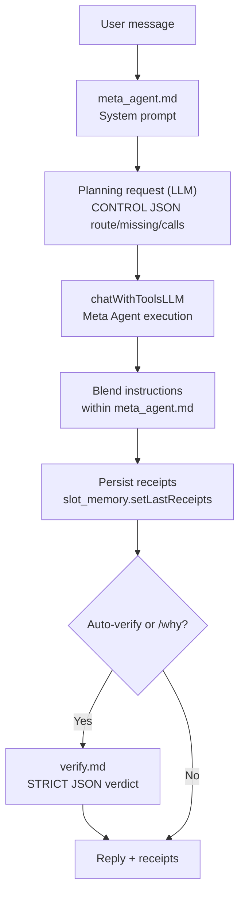

Prompt Inventory
- **meta_agent.md** — single governing super-prompt (Analyze → Plan → Act → Blend).
  Embeds routing guidance, policy/RAG rules, consent logic, groundedness guardrails,
  ledger expectations, and tool schemas.
- **Planning CONTROL block** — inline system hints issued by `callChatWithTools`
  (no separate file). Produces strict JSON with `route`, `confidence`, `missing`,
  `consent`, and `calls` array.
- **complexity_assessor.md** — optional helper prompt to annotate
  complexity/budget for planning (only when enabled).
- **verify.md** — STRICT JSON verifier for auto-verify and `/why` fallback
  (pass/warn/fail, confidence, notes, scores, revised answer).
- Legacy prompts (router, blend, policy, etc.) remain archived under
  `root/src/prompts/multiprompt.md` for reference but are not executed in the
  Big LLM flow.
